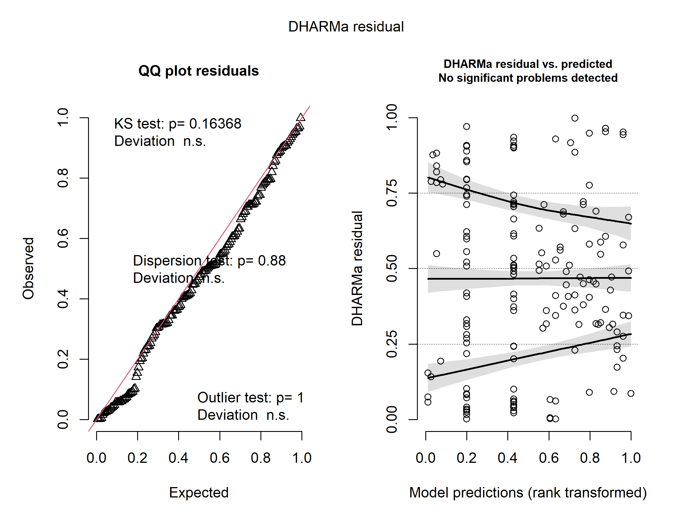
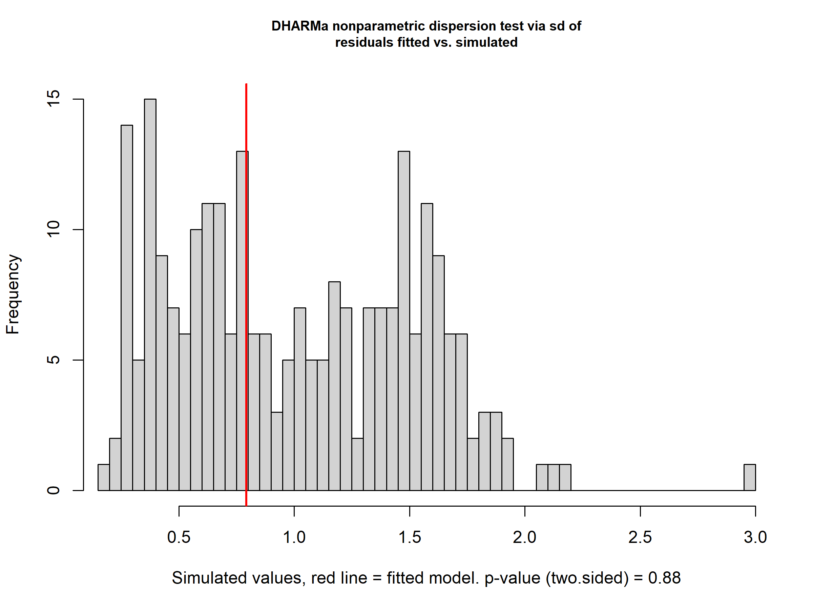
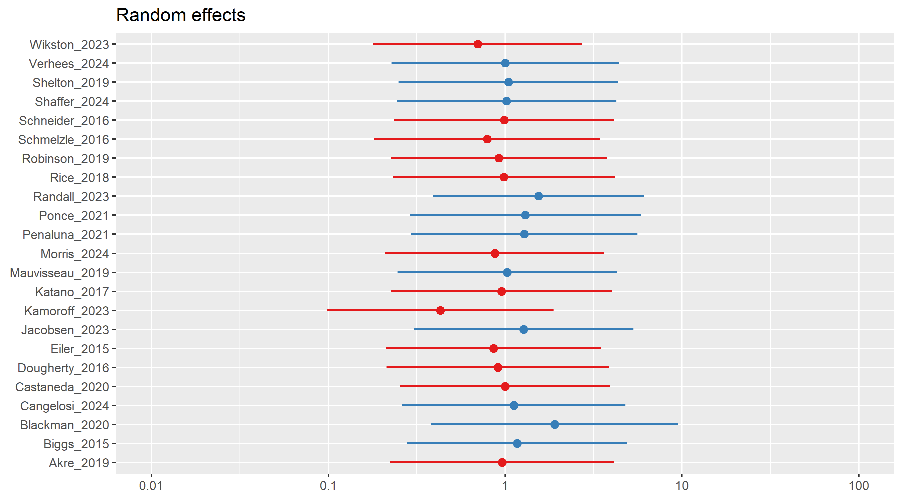
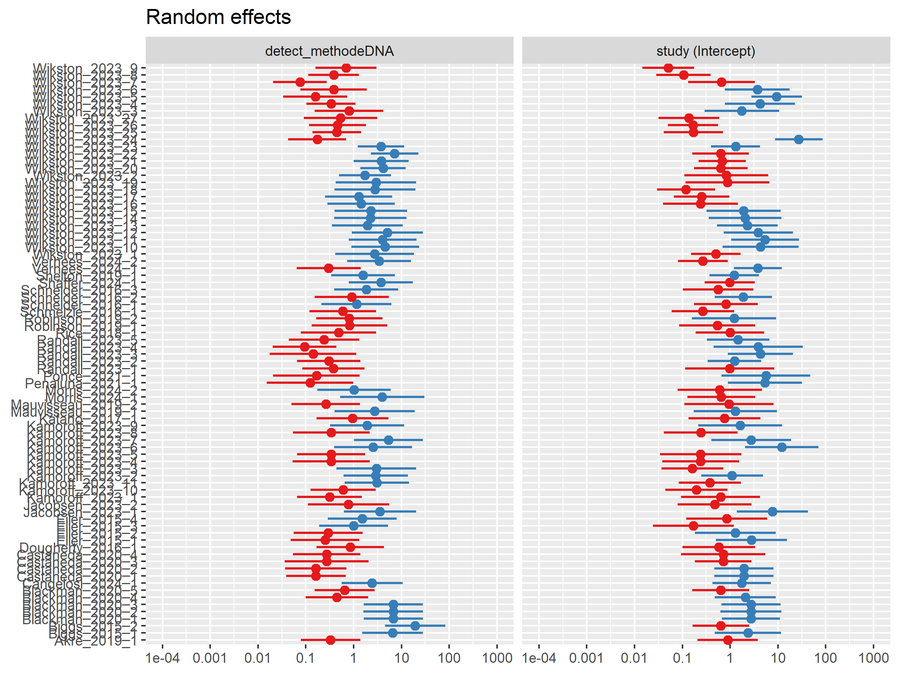
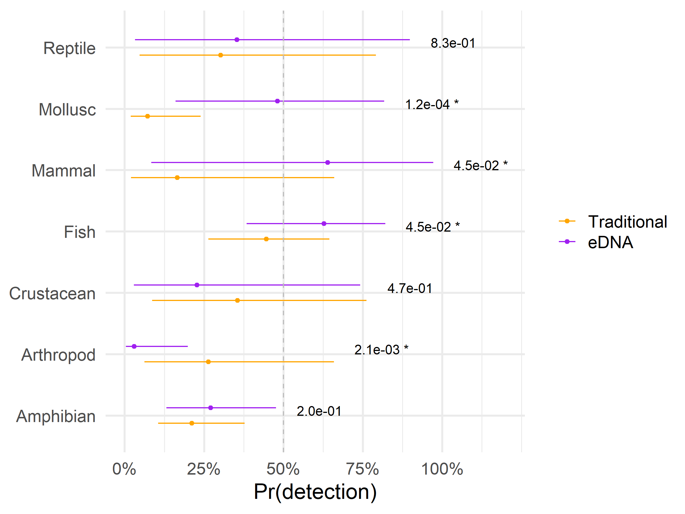
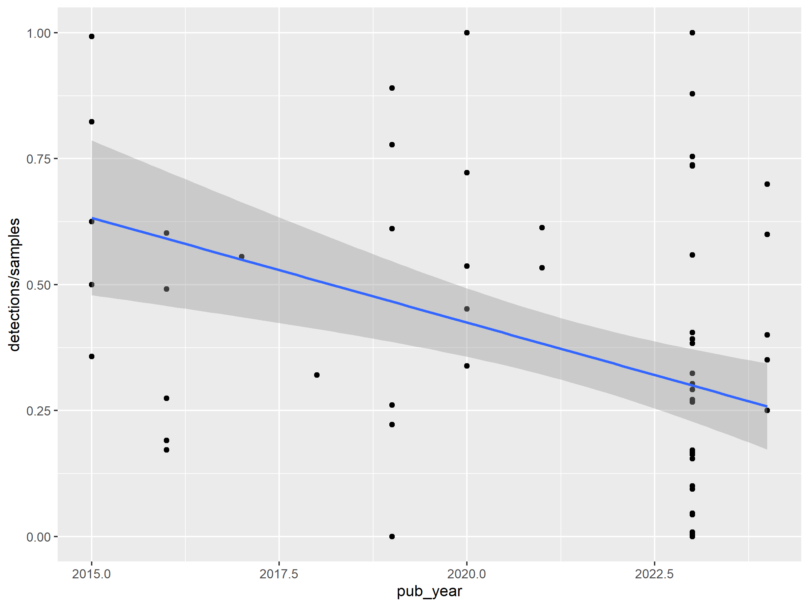

Meta Analysis Workflow
================
Dr. Riley M. Anderson
October 13, 2025

  

- [Overview](#overview)
  - [Summary of Results](#summary-of-results)
- [GLMM approach](#glmm-approach)
- [Session Information](#session-information)

## Overview

This is a test of some meta analysis packages and a template for the
workflow.

### Summary of Results

- 

## GLMM approach

With a glmm we can account for within and across study variance and use
the direct counts from each study. No need for effect size and variance
estimation.

Moreover, if we can get a random slope to coverge, this approach exactly
mirrors that of a multilevel random-effects meta-analysis.

    ## Overdispersion ratio for model: mod9 
    ## formula: cbind(detections, misses) ~ detect_method * organism + scale(pub_year):detect_method + (1 | paper) + (1 + detect_method | study) 
    ## 
    ## Acceptable range: 1 - 1.4
    ## Overdispersion ratio: 0.175  df: 150  p = 1 
    ##  Data are NOT OVERDISPERSED
    ##     ratio  deviance        df    pvalue 
    ##   0.17500  26.20605 150.00000   1.00000

<!-- --><!-- -->

    ## 
    ##  DHARMa nonparametric dispersion test via sd of residuals fitted vs.
    ##  simulated
    ## 
    ## data:  simulationOutput
    ## dispersion = 0.79296, p-value = 0.88
    ## alternative hypothesis: two.sided
    ##  Family: binomial  ( logit )
    ## Formula:          
    ## cbind(detections, misses) ~ detect_method * organism + scale(pub_year):detect_method +  
    ##     (1 | paper) + (1 + detect_method | study)
    ## Data: subset(d2, organism != "Hydrozoan")
    ## 
    ##      AIC      BIC   logLik deviance df.resid 
    ##   1281.5   1344.3   -620.8   1241.5      150 
    ## 
    ## Random effects:
    ## 
    ## Conditional model:
    ##  Groups Name              Variance Std.Dev. Corr  
    ##  paper  (Intercept)       0.325    0.5701         
    ##  study  (Intercept)       1.916    1.3843         
    ##         detect_methodeDNA 2.056    1.4338   -0.11 
    ## Number of obs: 170, groups:  paper, 23; study, 81
    ## 
    ## Conditional model:
    ##                                          Estimate Std. Error z value Pr(>|z|)
    ## (Intercept)                              -1.31412    0.41721  -3.150 0.001634
    ## detect_methodeDNA                         0.32299    0.25189   1.282 0.199746
    ## organismArthropod                         0.28907    0.90973   0.318 0.750672
    ## organismCrustacean                        0.71928    0.96776   0.743 0.457336
    ## organismFish                              1.09936    0.54412   2.020 0.043339
    ## organismMammal                           -0.29974    1.25655  -0.239 0.811462
    ## organismMollusc                          -1.23130    0.83725  -1.471 0.141389
    ## organismReptile                           0.48002    1.13246   0.424 0.671655
    ## detect_methodeDNA:organismArthropod      -2.77808    0.85017  -3.268 0.001084
    ## detect_methodeDNA:organismCrustacean     -0.94600    0.90799  -1.042 0.297472
    ## detect_methodeDNA:organismFish            0.41614    0.44782   0.929 0.352761
    ## detect_methodeDNA:organismMammal          1.86246    1.11128   1.676 0.093745
    ## detect_methodeDNA:organismMollusc         2.14622    0.68810   3.119 0.001814
    ## detect_methodeDNA:organismReptile        -0.09252    1.10270  -0.084 0.933133
    ## detect_methodTraditional:scale(pub_year) -0.61762    0.24344  -2.537 0.011179
    ## detect_methodeDNA:scale(pub_year)        -1.02372    0.29058  -3.523 0.000427
    ##                                             
    ## (Intercept)                              ** 
    ## detect_methodeDNA                           
    ## organismArthropod                           
    ## organismCrustacean                          
    ## organismFish                             *  
    ## organismMammal                              
    ## organismMollusc                             
    ## organismReptile                             
    ## detect_methodeDNA:organismArthropod      ** 
    ## detect_methodeDNA:organismCrustacean        
    ## detect_methodeDNA:organismFish              
    ## detect_methodeDNA:organismMammal         .  
    ## detect_methodeDNA:organismMollusc        ** 
    ## detect_methodeDNA:organismReptile           
    ## detect_methodTraditional:scale(pub_year) *  
    ## detect_methodeDNA:scale(pub_year)        ***
    ## ---
    ## Signif. codes:  0 '***' 0.001 '**' 0.01 '*' 0.05 '.' 0.1 ' ' 1

<!-- -->

    ## organism = Amphibian:
    ##  contrast           estimate    SE  df z.ratio p.value
    ##  Traditional - eDNA   -0.323 0.252 Inf  -1.282  0.1997
    ## 
    ## organism = Arthropod:
    ##  contrast           estimate    SE  df z.ratio p.value
    ##  Traditional - eDNA    2.455 0.799 Inf   3.075  0.0021
    ## 
    ## organism = Crustacean:
    ##  contrast           estimate    SE  df z.ratio p.value
    ##  Traditional - eDNA    0.623 0.866 Inf   0.719  0.4719
    ## 
    ## organism = Fish:
    ##  contrast           estimate    SE  df z.ratio p.value
    ##  Traditional - eDNA   -0.739 0.369 Inf  -2.002  0.0453
    ## 
    ## organism = Mammal:
    ##  contrast           estimate    SE  df z.ratio p.value
    ##  Traditional - eDNA   -2.185 1.089 Inf  -2.007  0.0448
    ## 
    ## organism = Mollusc:
    ##  contrast           estimate    SE  df z.ratio p.value
    ##  Traditional - eDNA   -2.469 0.643 Inf  -3.841  0.0001
    ## 
    ## organism = Reptile:
    ##  contrast           estimate    SE  df z.ratio p.value
    ##  Traditional - eDNA   -0.230 1.072 Inf  -0.215  0.8298
    ## 
    ## Results are given on the log odds ratio (not the response) scale.

    ##  Family: binomial  ( logit )
    ## Formula:          
    ## cbind(detections, misses) ~ detect_method * organism + scale(pub_year):detect_method +  
    ##     (1 | paper) + (1 + detect_method | study)
    ## Data: subset(d2, organism != "Hydrozoan")
    ## 
    ##      AIC      BIC   logLik deviance df.resid 
    ##   1281.5   1344.3   -620.8   1241.5      150 
    ## 
    ## Random effects:
    ## 
    ## Conditional model:
    ##  Groups Name              Variance Std.Dev. Corr  
    ##  paper  (Intercept)       0.325    0.5701         
    ##  study  (Intercept)       1.916    1.3843         
    ##         detect_methodeDNA 2.056    1.4338   -0.11 
    ## Number of obs: 170, groups:  paper, 23; study, 81
    ## 
    ## Conditional model:
    ##                                          Estimate Std. Error z value Pr(>|z|)
    ## (Intercept)                              -1.31412    0.41721  -3.150 0.001634
    ## detect_methodeDNA                         0.32299    0.25189   1.282 0.199746
    ## organismArthropod                         0.28907    0.90973   0.318 0.750672
    ## organismCrustacean                        0.71928    0.96776   0.743 0.457336
    ## organismFish                              1.09936    0.54412   2.020 0.043339
    ## organismMammal                           -0.29974    1.25655  -0.239 0.811462
    ## organismMollusc                          -1.23130    0.83725  -1.471 0.141389
    ## organismReptile                           0.48002    1.13246   0.424 0.671655
    ## detect_methodeDNA:organismArthropod      -2.77808    0.85017  -3.268 0.001084
    ## detect_methodeDNA:organismCrustacean     -0.94600    0.90799  -1.042 0.297472
    ## detect_methodeDNA:organismFish            0.41614    0.44782   0.929 0.352761
    ## detect_methodeDNA:organismMammal          1.86246    1.11128   1.676 0.093745
    ## detect_methodeDNA:organismMollusc         2.14622    0.68810   3.119 0.001814
    ## detect_methodeDNA:organismReptile        -0.09252    1.10270  -0.084 0.933133
    ## detect_methodTraditional:scale(pub_year) -0.61762    0.24344  -2.537 0.011179
    ## detect_methodeDNA:scale(pub_year)        -1.02372    0.29058  -3.523 0.000427
    ##                                             
    ## (Intercept)                              ** 
    ## detect_methodeDNA                           
    ## organismArthropod                           
    ## organismCrustacean                          
    ## organismFish                             *  
    ## organismMammal                              
    ## organismMollusc                             
    ## organismReptile                             
    ## detect_methodeDNA:organismArthropod      ** 
    ## detect_methodeDNA:organismCrustacean        
    ## detect_methodeDNA:organismFish              
    ## detect_methodeDNA:organismMammal         .  
    ## detect_methodeDNA:organismMollusc        ** 
    ## detect_methodeDNA:organismReptile           
    ## detect_methodTraditional:scale(pub_year) *  
    ## detect_methodeDNA:scale(pub_year)        ***
    ## ---
    ## Signif. codes:  0 '***' 0.001 '**' 0.01 '*' 0.05 '.' 0.1 ' ' 1
    ## [[1]]

<!-- -->

    ## 
    ## [[2]]

<!-- -->
<!-- -->

<!-- -->

## Session Information

    R version 4.2.3 (2023-03-15 ucrt)
    Platform: x86_64-w64-mingw32/x64 (64-bit)
    Running under: Windows 10 x64 (build 26100)

    Matrix products: default

    locale:
    [1] LC_COLLATE=English_United States.utf8 
    [2] LC_CTYPE=English_United States.utf8   
    [3] LC_MONETARY=English_United States.utf8
    [4] LC_NUMERIC=C                          
    [5] LC_TIME=English_United States.utf8    

    attached base packages:
    [1] stats     graphics  grDevices utils     datasets  methods   base     

    other attached packages:
     [1] lubridate_1.9.3     forcats_1.0.0       stringr_1.5.1      
     [4] dplyr_1.1.4         purrr_1.0.2         readr_2.1.5        
     [7] tidyr_1.3.1         tibble_3.2.1        ggplot2_3.5.1      
    [10] tidyverse_2.0.0     multcomp_1.4-25     TH.data_1.1-2      
    [13] MASS_7.3-58.2       survival_3.5-3      mvtnorm_1.2-5      
    [16] emmeans_1.10.2      DHARMa_0.4.7        sjPlot_2.8.16      
    [19] glmmTMB_1.1.9       metafor_4.8-0       numDeriv_2016.8-1.1
    [22] metadat_1.4-0       Matrix_1.5-3       

    loaded via a namespace (and not attached):
     [1] nlme_3.1-162        RColorBrewer_1.1-3  insight_1.0.1      
     [4] doParallel_1.0.17   rprojroot_2.0.4     tools_4.2.3        
     [7] TMB_1.9.11          utf8_1.2.4          R6_2.5.1           
    [10] sjlabelled_1.2.0    mgcv_1.8-42         colorspace_2.1-0   
    [13] withr_3.0.0         tidyselect_1.2.1    compiler_4.2.3     
    [16] performance_0.12.0  cli_3.6.2           sandwich_3.1-0     
    [19] labeling_0.4.3      scales_1.3.0        multcompView_0.1-10
    [22] digest_0.6.35       minqa_1.2.7         rmarkdown_2.27     
    [25] pkgconfig_2.0.3     htmltools_0.5.8.1   lme4_1.1-35.3      
    [28] highr_0.11          fastmap_1.2.0       rlang_1.1.4        
    [31] rstudioapi_0.16.0   shiny_1.8.1.1       farver_2.1.2       
    [34] generics_0.1.3      zoo_1.8-12          magrittr_2.0.3     
    [37] Rcpp_1.0.12         munsell_0.5.1       fansi_1.0.6        
    [40] lifecycle_1.0.4     stringi_1.8.4       yaml_2.3.8         
    [43] mathjaxr_1.8-0      plyr_1.8.9          grid_4.2.3         
    [46] promises_1.3.0      parallel_4.2.3      qgam_1.3.4         
    [49] sjmisc_2.8.10       lattice_0.20-45     haven_2.5.4        
    [52] ggeffects_1.6.0     splines_4.2.3       sjstats_0.19.0     
    [55] hms_1.1.3           knitr_1.47          pillar_1.9.0       
    [58] boot_1.3-28.1       estimability_1.5.1  codetools_0.2-19   
    [61] glue_1.7.0          evaluate_0.24.0     vctrs_0.6.5        
    [64] nloptr_2.0.3        tzdb_0.4.0          httpuv_1.6.15      
    [67] Rdpack_2.6          foreach_1.5.2       gtable_0.3.5       
    [70] datawizard_0.11.0   xfun_0.44           mime_0.12          
    [73] rbibutils_2.2.16    gap.datasets_0.0.6  xtable_1.8-4       
    [76] coda_0.19-4.1       later_1.3.2         iterators_1.0.14   
    [79] timechange_0.3.0    gap_1.6            
