Detection Methods Meta-analysis
================
Dr. Riley M. Anderson & Taydin Macon
November 20, 2025

  

- [Overview](#overview)
  - [Summary of Results](#summary-of-results)
- [GLMM approach](#glmm-approach)
  - [Study-level analysis](#study-level-analysis)
  - [Study-level main figure:](#study-level-main-figure)
  - [Sample-level analysis:](#sample-level-analysis)
- [Log odds for study level analysis - Taydin is still working on
  this.](#log-odds-for-study-level-analysis---taydin-is-still-working-on-this)
- [Log odds](#log-odds)
  - [Log odds study level](#log-odds-study-level)
  - [Log-odds sample level](#log-odds-sample-level)
  - [Session Information](#session-information)

## Overview

A meta-analysis comparing detection probabilities of traditional and
eDNA methods.

### Summary of Results

- 

# GLMM approach

With a glmm we can account for within and across study variance and use
the direct counts from each study. No need for effect size and variance
estimation.

Moreover, if we can get a random slope to coverge, this approach exactly
mirrors that of a multilevel random-effects meta-analysis.

## Study-level analysis

    ## Data: d1
    ## Models:
    ## MODEL1: cbind(detections, misses) ~ detect_method + (1 | paper) + (1 | , zi=~0, disp=~1
    ## MODEL1:     study), zi=~0, disp=~1
    ## MODEL2: cbind(detections, misses) ~ detect_method + (1 | paper) + (1 | , zi=~0, disp=~1
    ## MODEL2:     study), zi=~0, disp=~1
    ## MODEL3: cbind(detections, misses) ~ detect_method + (1 | paper) + (1 + , zi=~0, disp=~1
    ## MODEL3:     detect_method | study), zi=~0, disp=~1
    ##        Df    AIC    BIC   logLik deviance  Chisq Chi Df Pr(>Chisq)    
    ## MODEL1  4 2986.1 3002.6 -1489.03   2978.1                             
    ## MODEL2  4 2986.1 3002.6 -1489.03   2978.1    0.0      0          1    
    ## MODEL3  6 1976.0 2000.7  -981.99   1964.0 1014.1      2     <2e-16 ***
    ## ---
    ## Signif. codes:  0 '***' 0.001 '**' 0.01 '*' 0.05 '.' 0.1 ' ' 1
    ##  Family: binomial  ( logit )
    ## Formula:          
    ## cbind(detections, misses) ~ detect_method + (1 | paper) + (1 +  
    ##     detect_method | study)
    ## Data: d1
    ## 
    ##      AIC      BIC   logLik deviance df.resid 
    ##   1976.0   2000.7   -982.0   1964.0      450 
    ## 
    ## Random effects:
    ## 
    ## Conditional model:
    ##  Groups Name              Variance Std.Dev. Corr  
    ##  paper  (Intercept)       2.528    1.590          
    ##  study  (Intercept)       7.690    2.773          
    ##         detect_methodeDNA 8.653    2.942    -0.90 
    ## Number of obs: 456, groups:  paper, 30; study, 228
    ## 
    ## Conditional model:
    ##                   Estimate Std. Error z value Pr(>|z|)    
    ## (Intercept)         1.1639     0.3916   2.972 0.002960 ** 
    ## detect_methodeDNA  -0.9330     0.2510  -3.718 0.000201 ***
    ## ---
    ## Signif. codes:  0 '***' 0.001 '**' 0.01 '*' 0.05 '.' 0.1 ' ' 1
    ##  Family: binomial  ( logit )
    ## Formula:          
    ## cbind(detections, misses) ~ detect_method * organism + scale(pub_year):detect_method +  
    ##     (1 | paper) + (1 + detect_method | study)
    ## Data: d1
    ## 
    ##      AIC      BIC   logLik deviance df.resid 
    ##   1848.6   1931.0   -904.3   1808.6      436 
    ## 
    ## Random effects:
    ## 
    ## Conditional model:
    ##  Groups Name              Variance  Std.Dev.  Corr  
    ##  paper  (Intercept)       1.213e-09 3.483e-05       
    ##  study  (Intercept)       3.295e+00 1.815e+00       
    ##         detect_methodeDNA 3.939e+00 1.985e+00 -0.47 
    ## Number of obs: 456, groups:  paper, 30; study, 228
    ## 
    ## Conditional model:
    ##                                          Estimate Std. Error z value Pr(>|z|)
    ## (Intercept)                               -0.6620     0.2929  -2.260  0.02380
    ## detect_methodeDNA                          1.1134     0.3360   3.314  0.00092
    ## organismArthropod                         -0.6331     0.3547  -1.785  0.07425
    ## organismCrustacean                         0.6978     0.9898   0.705  0.48084
    ## organismFish                               0.9258     0.4714   1.964  0.04951
    ## organismMammal                             1.9160     1.3744   1.394  0.16330
    ## organismMollusc                           -0.6493     0.7914  -0.820  0.41197
    ## organismReptile                           -0.4220     1.0346  -0.408  0.68336
    ## detect_methodeDNA:organismArthropod       -5.1515     0.5167  -9.971  < 2e-16
    ## detect_methodeDNA:organismCrustacean      -0.7404     1.1286  -0.656  0.51181
    ## detect_methodeDNA:organismFish             0.4068     0.5590   0.728  0.46680
    ## detect_methodeDNA:organismMammal          -1.3624     1.5344  -0.888  0.37459
    ## detect_methodeDNA:organismMollusc          1.3918     0.9765   1.425  0.15404
    ## detect_methodeDNA:organismReptile         -1.6174     1.2064  -1.341  0.18003
    ## detect_methodTraditional:scale(pub_year)  -0.3579     0.1408  -2.542  0.01101
    ## detect_methodeDNA:scale(pub_year)         -0.7512     0.1558  -4.823 1.42e-06
    ##                                             
    ## (Intercept)                              *  
    ## detect_methodeDNA                        ***
    ## organismArthropod                        .  
    ## organismCrustacean                          
    ## organismFish                             *  
    ## organismMammal                              
    ## organismMollusc                             
    ## organismReptile                             
    ## detect_methodeDNA:organismArthropod      ***
    ## detect_methodeDNA:organismCrustacean        
    ## detect_methodeDNA:organismFish              
    ## detect_methodeDNA:organismMammal            
    ## detect_methodeDNA:organismMollusc           
    ## detect_methodeDNA:organismReptile           
    ## detect_methodTraditional:scale(pub_year) *  
    ## detect_methodeDNA:scale(pub_year)        ***
    ## ---
    ## Signif. codes:  0 '***' 0.001 '**' 0.01 '*' 0.05 '.' 0.1 ' ' 1
    ## Data: d1
    ## Models:
    ## study_mod3: cbind(detections, misses) ~ detect_method * organism + scale(pub_year) + , zi=~0, disp=~1
    ## study_mod3:     (1 | paper) + (1 + detect_method | study), zi=~0, disp=~1
    ## study_mod2: cbind(detections, misses) ~ detect_method * organism + scale(pub_year):detect_method + , zi=~0, disp=~1
    ## study_mod2:     (1 | paper) + (1 + detect_method | study), zi=~0, disp=~1
    ## study_mod4: cbind(detections, misses) ~ detect_method * organism + scale(pub_year):detect_method + , zi=~0, disp=~1
    ## study_mod4:     col_method_edna + (1 | paper) + (1 + detect_method | study), zi=~0, disp=~1
    ##            Df    AIC    BIC  logLik deviance  Chisq Chi Df Pr(>Chisq)   
    ## study_mod3 19 1852.1 1930.4 -907.04   1814.1                            
    ## study_mod2 20 1848.6 1931.0 -904.29   1808.6 5.5041      1   0.018971 * 
    ## study_mod4 21 1843.2 1929.8 -900.59   1801.2 7.4127      1   0.006477 **
    ## ---
    ## Signif. codes:  0 '***' 0.001 '**' 0.01 '*' 0.05 '.' 0.1 ' ' 1

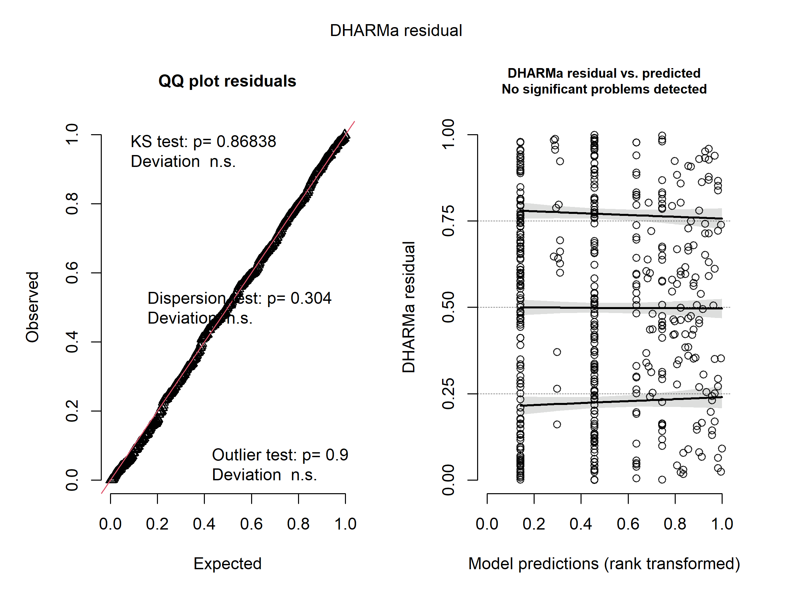<!-- -->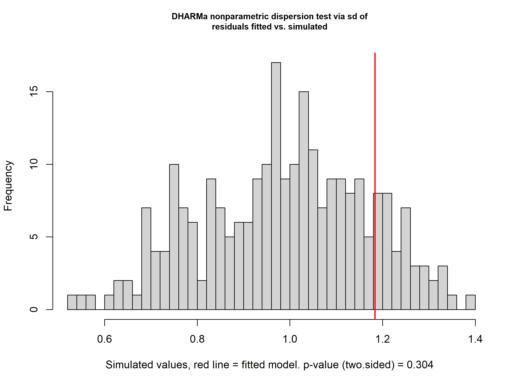<!-- -->

    ## 
    ##  DHARMa nonparametric dispersion test via sd of residuals fitted vs.
    ##  simulated
    ## 
    ## data:  simulationOutput
    ## dispersion = 1.1966, p-value = 0.312
    ## alternative hypothesis: two.sided

## Study-level main figure:

    ##  Family: binomial  ( logit )
    ## Formula:          
    ## cbind(detections, misses) ~ detect_method * organism + scale(pub_year):detect_method +  
    ##     (1 | paper) + (1 + detect_method | study)
    ## Data: d1
    ## 
    ##      AIC      BIC   logLik deviance df.resid 
    ##   1848.6   1931.0   -904.3   1808.6      436 
    ## 
    ## Random effects:
    ## 
    ## Conditional model:
    ##  Groups Name              Variance  Std.Dev.  Corr  
    ##  paper  (Intercept)       1.213e-09 3.483e-05       
    ##  study  (Intercept)       3.295e+00 1.815e+00       
    ##         detect_methodeDNA 3.939e+00 1.985e+00 -0.47 
    ## Number of obs: 456, groups:  paper, 30; study, 228
    ## 
    ## Conditional model:
    ##                                          Estimate Std. Error z value Pr(>|z|)
    ## (Intercept)                               -0.6620     0.2929  -2.260  0.02380
    ## detect_methodeDNA                          1.1134     0.3360   3.314  0.00092
    ## organismArthropod                         -0.6331     0.3547  -1.785  0.07425
    ## organismCrustacean                         0.6978     0.9898   0.705  0.48084
    ## organismFish                               0.9258     0.4714   1.964  0.04951
    ## organismMammal                             1.9160     1.3744   1.394  0.16330
    ## organismMollusc                           -0.6493     0.7914  -0.820  0.41197
    ## organismReptile                           -0.4220     1.0346  -0.408  0.68336
    ## detect_methodeDNA:organismArthropod       -5.1515     0.5167  -9.971  < 2e-16
    ## detect_methodeDNA:organismCrustacean      -0.7404     1.1286  -0.656  0.51181
    ## detect_methodeDNA:organismFish             0.4068     0.5590   0.728  0.46680
    ## detect_methodeDNA:organismMammal          -1.3624     1.5344  -0.888  0.37459
    ## detect_methodeDNA:organismMollusc          1.3918     0.9765   1.425  0.15404
    ## detect_methodeDNA:organismReptile         -1.6174     1.2064  -1.341  0.18003
    ## detect_methodTraditional:scale(pub_year)  -0.3579     0.1408  -2.542  0.01101
    ## detect_methodeDNA:scale(pub_year)         -0.7512     0.1558  -4.823 1.42e-06
    ##                                             
    ## (Intercept)                              *  
    ## detect_methodeDNA                        ***
    ## organismArthropod                        .  
    ## organismCrustacean                          
    ## organismFish                             *  
    ## organismMammal                              
    ## organismMollusc                             
    ## organismReptile                             
    ## detect_methodeDNA:organismArthropod      ***
    ## detect_methodeDNA:organismCrustacean        
    ## detect_methodeDNA:organismFish              
    ## detect_methodeDNA:organismMammal            
    ## detect_methodeDNA:organismMollusc           
    ## detect_methodeDNA:organismReptile           
    ## detect_methodTraditional:scale(pub_year) *  
    ## detect_methodeDNA:scale(pub_year)        ***
    ## ---
    ## Signif. codes:  0 '***' 0.001 '**' 0.01 '*' 0.05 '.' 0.1 ' ' 1
    ## [[1]]

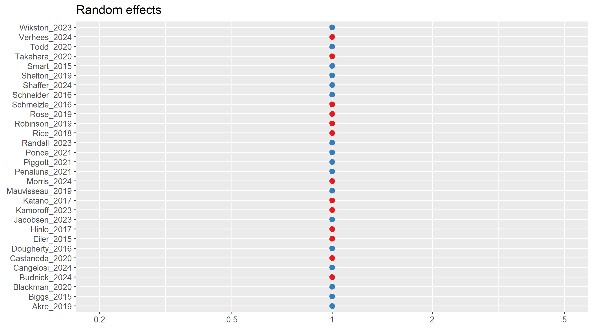<!-- -->

    ## 
    ## [[2]]

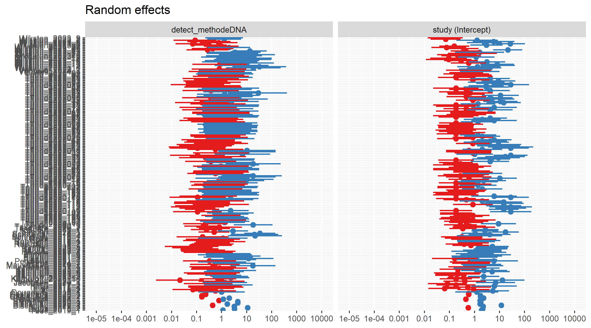<!-- -->
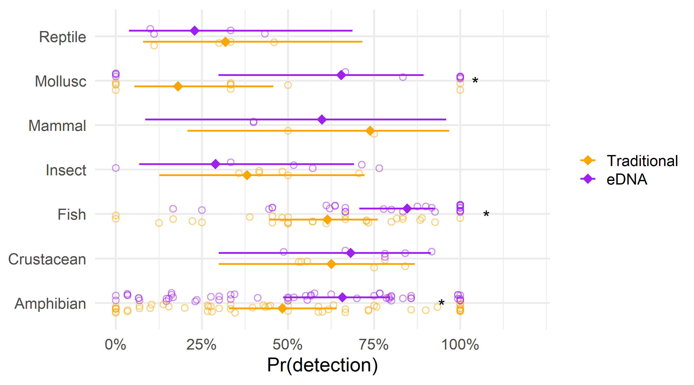<!-- -->

## Sample-level analysis:

    ##  Family: binomial  ( logit )
    ## Formula:          
    ## cbind(detections, misses) ~ detect_method + (1 | paper) + (1 |      study)
    ## Data: subset(d2, organism != "Hydrozoan")
    ## 
    ##      AIC      BIC   logLik deviance df.resid 
    ##   2320.1   2332.5  -1156.0   2312.1      160 
    ## 
    ## Random effects:
    ## 
    ## Conditional model:
    ##  Groups Name        Variance Std.Dev.
    ##  paper  (Intercept) 0.7292   0.8539  
    ##  study  (Intercept) 2.1895   1.4797  
    ## Number of obs: 164, groups:  paper, 24; study, 82
    ## 
    ## Conditional model:
    ##                   Estimate Std. Error z value Pr(>|z|)    
    ## (Intercept)       -0.63542    0.28705  -2.214   0.0269 *  
    ## detect_methodeDNA  0.22559    0.04189   5.386 7.21e-08 ***
    ## ---
    ## Signif. codes:  0 '***' 0.001 '**' 0.01 '*' 0.05 '.' 0.1 ' ' 1
    ## Overdispersion ratio for model: mod9 
    ## formula: cbind(detections, misses) ~ detect_method * organism + scale(pub_year):detect_method + (1 | paper) + (1 + detect_method | study) 
    ## 
    ## Acceptable range: 1 - 1.4
    ## Overdispersion ratio: 0.188  df: 144  p = 1 
    ##  Data are NOT OVERDISPERSED
    ##     ratio  deviance        df    pvalue 
    ##   0.18800  27.09426 144.00000   1.00000

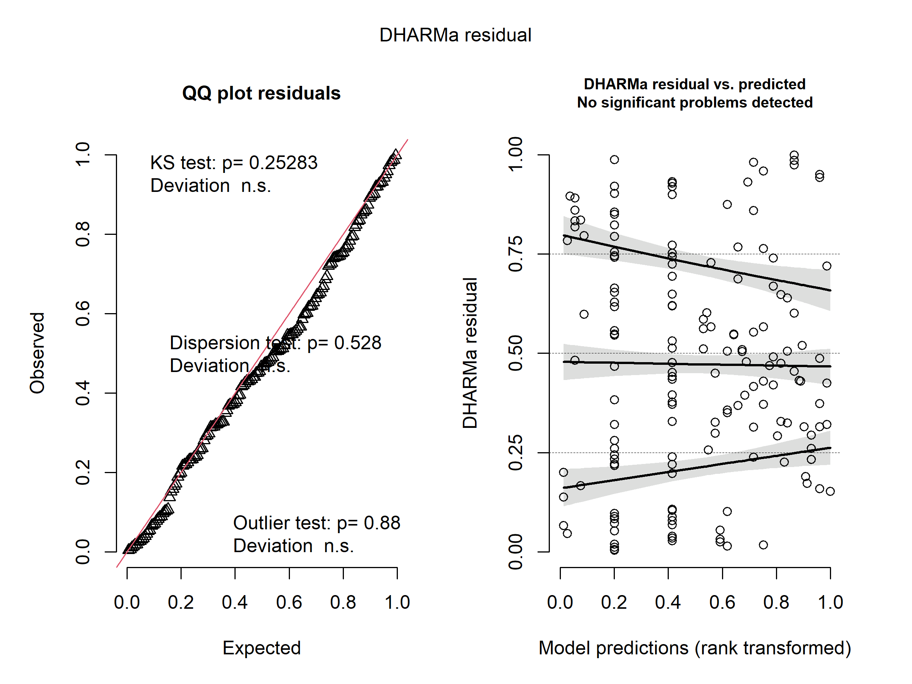<!-- -->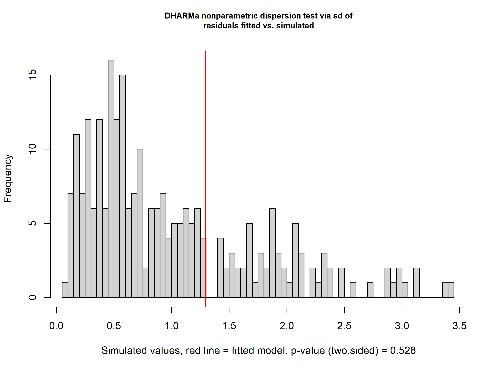<!-- -->

    ## 
    ##  DHARMa nonparametric dispersion test via sd of residuals fitted vs.
    ##  simulated
    ## 
    ## data:  simulationOutput
    ## dispersion = 1.291, p-value = 0.528
    ## alternative hypothesis: two.sided
    ##  Family: binomial  ( logit )
    ## Formula:          
    ## cbind(detections, misses) ~ detect_method * organism + scale(pub_year):detect_method +  
    ##     (1 | paper) + (1 + detect_method | study)
    ## Data: subset(d2, organism != "Hydrozoan")
    ## 
    ##      AIC      BIC   logLik deviance df.resid 
    ##   1280.9   1342.9   -620.4   1240.9      144 
    ## 
    ## Random effects:
    ## 
    ## Conditional model:
    ##  Groups Name              Variance Std.Dev. Corr  
    ##  paper  (Intercept)       0.3341   0.578          
    ##  study  (Intercept)       1.8004   1.342          
    ##         detect_methodeDNA 2.0242   1.423    -0.10 
    ## Number of obs: 164, groups:  paper, 24; study, 82
    ## 
    ## Conditional model:
    ##                                          Estimate Std. Error z value Pr(>|z|)
    ## (Intercept)                              -1.26181    0.41319  -3.054 0.002259
    ## detect_methodeDNA                         0.32289    0.25142   1.284 0.199042
    ## organismArthropod                         0.32685    0.89392   0.366 0.714633
    ## organismCrustacean                        1.04469    0.84111   1.242 0.214223
    ## organismFish                              1.06932    0.53652   1.993 0.046253
    ## organismMammal                           -0.39340    1.23374  -0.319 0.749824
    ## organismMollusc                          -1.24425    0.82480  -1.509 0.131417
    ## organismReptile                           0.47204    1.10540   0.427 0.669357
    ## detect_methodeDNA:organismArthropod      -2.80911    0.84169  -3.337 0.000845
    ## detect_methodeDNA:organismCrustacean     -1.17059    0.77978  -1.501 0.133311
    ## detect_methodeDNA:organismFish            0.42079    0.44516   0.945 0.344522
    ## detect_methodeDNA:organismMammal          1.89494    1.10351   1.717 0.085943
    ## detect_methodeDNA:organismMollusc         2.13012    0.68249   3.121 0.001802
    ## detect_methodeDNA:organismReptile        -0.09083    1.09504  -0.083 0.933891
    ## detect_methodTraditional:scale(pub_year) -0.57218    0.23783  -2.406 0.016138
    ## detect_methodeDNA:scale(pub_year)        -1.01088    0.28681  -3.525 0.000424
    ##                                             
    ## (Intercept)                              ** 
    ## detect_methodeDNA                           
    ## organismArthropod                           
    ## organismCrustacean                          
    ## organismFish                             *  
    ## organismMammal                              
    ## organismMollusc                             
    ## organismReptile                             
    ## detect_methodeDNA:organismArthropod      ***
    ## detect_methodeDNA:organismCrustacean        
    ## detect_methodeDNA:organismFish              
    ## detect_methodeDNA:organismMammal         .  
    ## detect_methodeDNA:organismMollusc        ** 
    ## detect_methodeDNA:organismReptile           
    ## detect_methodTraditional:scale(pub_year) *  
    ## detect_methodeDNA:scale(pub_year)        ***
    ## ---
    ## Signif. codes:  0 '***' 0.001 '**' 0.01 '*' 0.05 '.' 0.1 ' ' 1

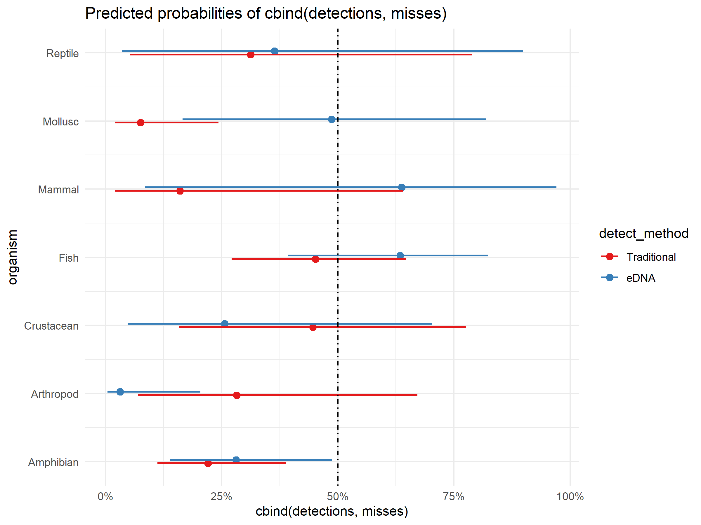<!-- -->

    ## organism = Amphibian:
    ##  contrast           estimate    SE  df z.ratio p.value
    ##  Traditional - eDNA   -0.323 0.251 Inf  -1.284  0.1990
    ## 
    ## organism = Arthropod:
    ##  contrast           estimate    SE  df z.ratio p.value
    ##  Traditional - eDNA    2.486 0.790 Inf   3.149  0.0016
    ## 
    ## organism = Crustacean:
    ##  contrast           estimate    SE  df z.ratio p.value
    ##  Traditional - eDNA    0.848 0.735 Inf   1.153  0.2488
    ## 
    ## organism = Fish:
    ##  contrast           estimate    SE  df z.ratio p.value
    ##  Traditional - eDNA   -0.744 0.367 Inf  -2.029  0.0425
    ## 
    ## organism = Mammal:
    ##  contrast           estimate    SE  df z.ratio p.value
    ##  Traditional - eDNA   -2.218 1.081 Inf  -2.051  0.0403
    ## 
    ## organism = Mollusc:
    ##  contrast           estimate    SE  df z.ratio p.value
    ##  Traditional - eDNA   -2.453 0.637 Inf  -3.850  0.0001
    ## 
    ## organism = Reptile:
    ##  contrast           estimate    SE  df z.ratio p.value
    ##  Traditional - eDNA   -0.232 1.065 Inf  -0.218  0.8275
    ## 
    ## Results are given on the log odds ratio (not the response) scale.

    ##  Family: binomial  ( logit )
    ## Formula:          
    ## cbind(detections, misses) ~ detect_method * organism + scale(pub_year):detect_method +  
    ##     (1 | paper) + (1 + detect_method | study)
    ## Data: subset(d2, organism != "Hydrozoan")
    ## 
    ##      AIC      BIC   logLik deviance df.resid 
    ##   1280.9   1342.9   -620.4   1240.9      144 
    ## 
    ## Random effects:
    ## 
    ## Conditional model:
    ##  Groups Name              Variance Std.Dev. Corr  
    ##  paper  (Intercept)       0.3341   0.578          
    ##  study  (Intercept)       1.8004   1.342          
    ##         detect_methodeDNA 2.0242   1.423    -0.10 
    ## Number of obs: 164, groups:  paper, 24; study, 82
    ## 
    ## Conditional model:
    ##                                          Estimate Std. Error z value Pr(>|z|)
    ## (Intercept)                              -1.26181    0.41319  -3.054 0.002259
    ## detect_methodeDNA                         0.32289    0.25142   1.284 0.199042
    ## organismArthropod                         0.32685    0.89392   0.366 0.714633
    ## organismCrustacean                        1.04469    0.84111   1.242 0.214223
    ## organismFish                              1.06932    0.53652   1.993 0.046253
    ## organismMammal                           -0.39340    1.23374  -0.319 0.749824
    ## organismMollusc                          -1.24425    0.82480  -1.509 0.131417
    ## organismReptile                           0.47204    1.10540   0.427 0.669357
    ## detect_methodeDNA:organismArthropod      -2.80911    0.84169  -3.337 0.000845
    ## detect_methodeDNA:organismCrustacean     -1.17059    0.77978  -1.501 0.133311
    ## detect_methodeDNA:organismFish            0.42079    0.44516   0.945 0.344522
    ## detect_methodeDNA:organismMammal          1.89494    1.10351   1.717 0.085943
    ## detect_methodeDNA:organismMollusc         2.13012    0.68249   3.121 0.001802
    ## detect_methodeDNA:organismReptile        -0.09083    1.09504  -0.083 0.933891
    ## detect_methodTraditional:scale(pub_year) -0.57218    0.23783  -2.406 0.016138
    ## detect_methodeDNA:scale(pub_year)        -1.01088    0.28681  -3.525 0.000424
    ##                                             
    ## (Intercept)                              ** 
    ## detect_methodeDNA                           
    ## organismArthropod                           
    ## organismCrustacean                          
    ## organismFish                             *  
    ## organismMammal                              
    ## organismMollusc                             
    ## organismReptile                             
    ## detect_methodeDNA:organismArthropod      ***
    ## detect_methodeDNA:organismCrustacean        
    ## detect_methodeDNA:organismFish              
    ## detect_methodeDNA:organismMammal         .  
    ## detect_methodeDNA:organismMollusc        ** 
    ## detect_methodeDNA:organismReptile           
    ## detect_methodTraditional:scale(pub_year) *  
    ## detect_methodeDNA:scale(pub_year)        ***
    ## ---
    ## Signif. codes:  0 '***' 0.001 '**' 0.01 '*' 0.05 '.' 0.1 ' ' 1
    ## [[1]]

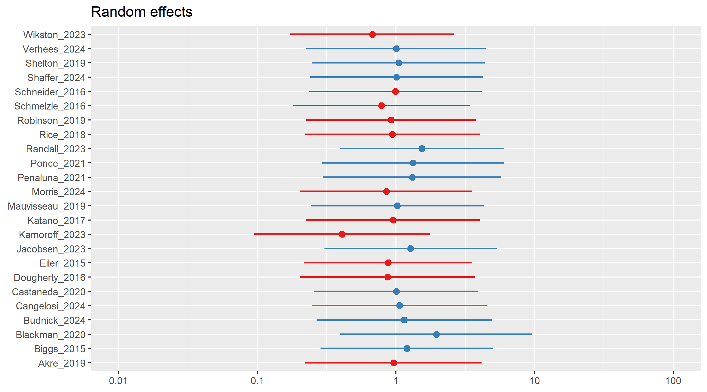<!-- -->

    ## 
    ## [[2]]

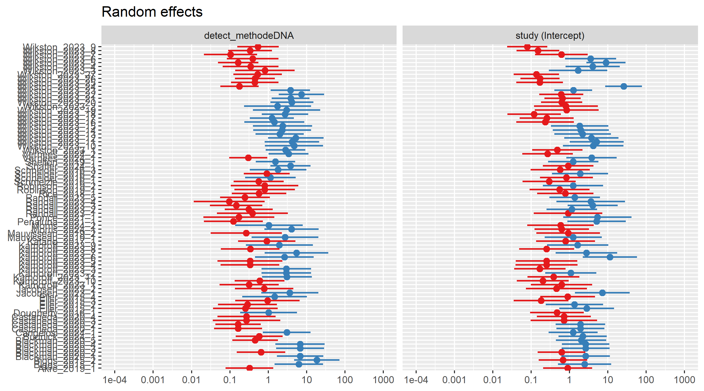<!-- -->
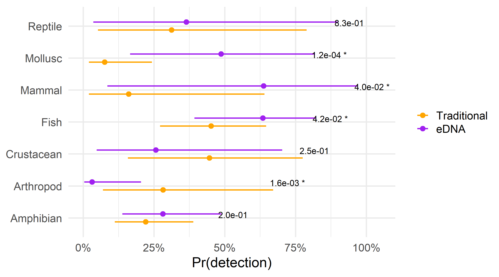<!-- -->

    ##  contrast           odds.ratio         SE  df null z.ratio p.value
    ##  Traditional / eDNA  0.7980421 0.03342705 Inf    1  -5.386  <.0001
    ## 
    ## Tests are performed on the log odds ratio scale

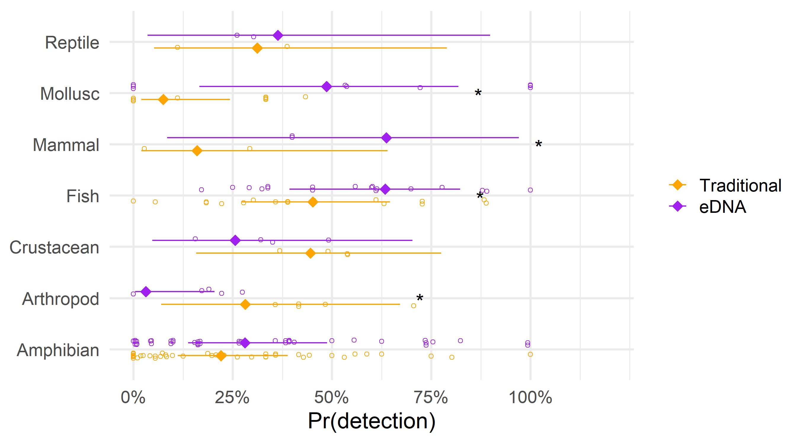<!-- -->

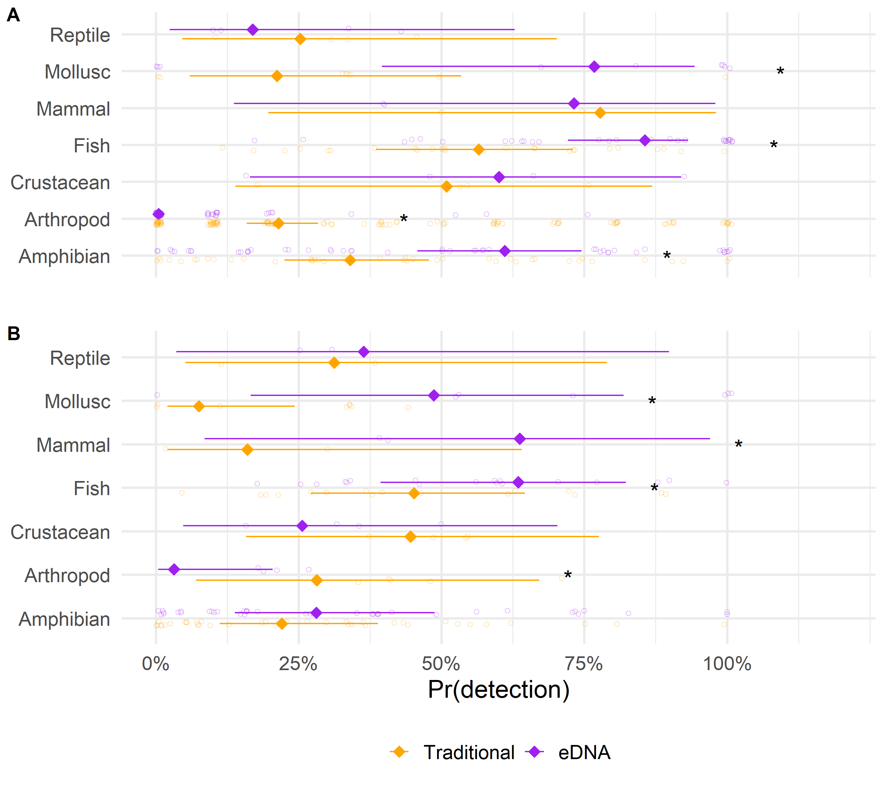<!-- -->

    ##  Family: binomial  ( logit )
    ## Formula:          
    ## cbind(detections, misses) ~ Methods * organism + (1 | paper) +      (1 | study)
    ## Data: d1_trad
    ## 
    ##      AIC      BIC   logLik deviance df.resid 
    ##   1175.0   1223.0   -573.5   1147.0      214 
    ## 
    ## Random effects:
    ## 
    ## Conditional model:
    ##  Groups Name        Variance  Std.Dev. 
    ##  paper  (Intercept) 2.164e-09 4.652e-05
    ##  study  (Intercept) 3.330e+00 1.825e+00
    ## Number of obs: 228, groups:  paper, 30; study, 228
    ## 
    ## Conditional model:
    ##                                   Estimate Std. Error z value Pr(>|z|)   
    ## (Intercept)                        -0.9427     0.3114  -3.027  0.00247 **
    ## MethodsPassive                      0.7821     0.7796   1.003  0.31580   
    ## organismArthropod                   0.8478     0.9069   0.935  0.34986   
    ## organismCrustacean                  1.1421     1.3810   0.827  0.40824   
    ## organismFish                        1.2477     0.5609   2.224  0.02612 * 
    ## organismMammal                      0.7349     1.5160   0.485  0.62782   
    ## organismMollusc                    -0.2869     0.7877  -0.364  0.71566   
    ## organismReptile                     0.4913     1.4093   0.349  0.72739   
    ## MethodsPassive:organismArthropod   -1.9379     1.1711  -1.655  0.09797 . 
    ## MethodsPassive:organismCrustacean  -1.2004     2.0540  -0.584  0.55893   
    ## MethodsPassive:organismFish        -1.1271     1.1007  -1.024  0.30587   
    ## MethodsPassive:organismMammal           NA         NA      NA       NA   
    ## MethodsPassive:organismMollusc          NA         NA      NA       NA   
    ## MethodsPassive:organismReptile     -1.9396     2.1447  -0.904  0.36580   
    ## ---
    ## Signif. codes:  0 '***' 0.001 '**' 0.01 '*' 0.05 '.' 0.1 ' ' 1

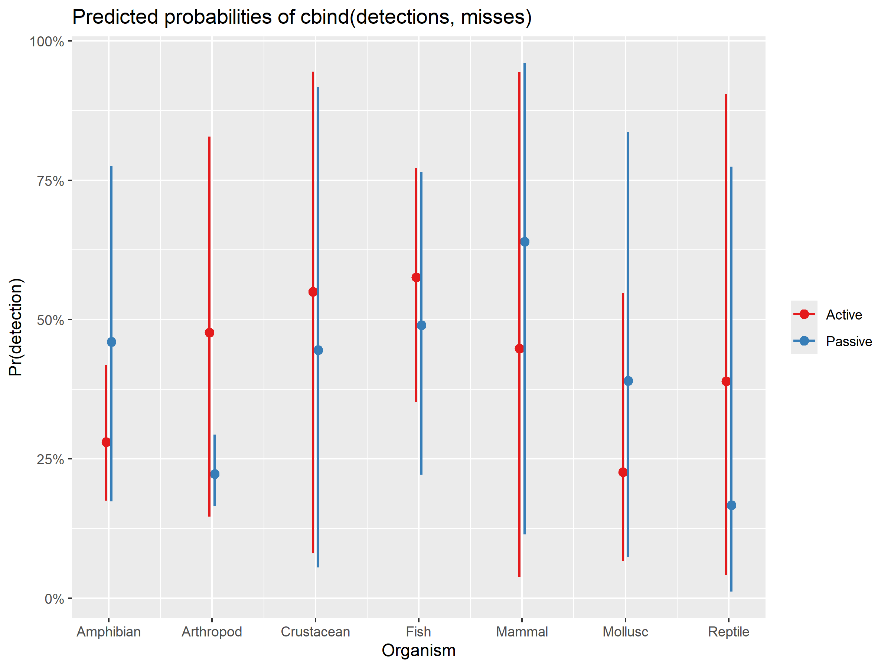<!-- -->

# Log odds for study level analysis - Taydin is still working on this.

# Log odds

## Log odds study level

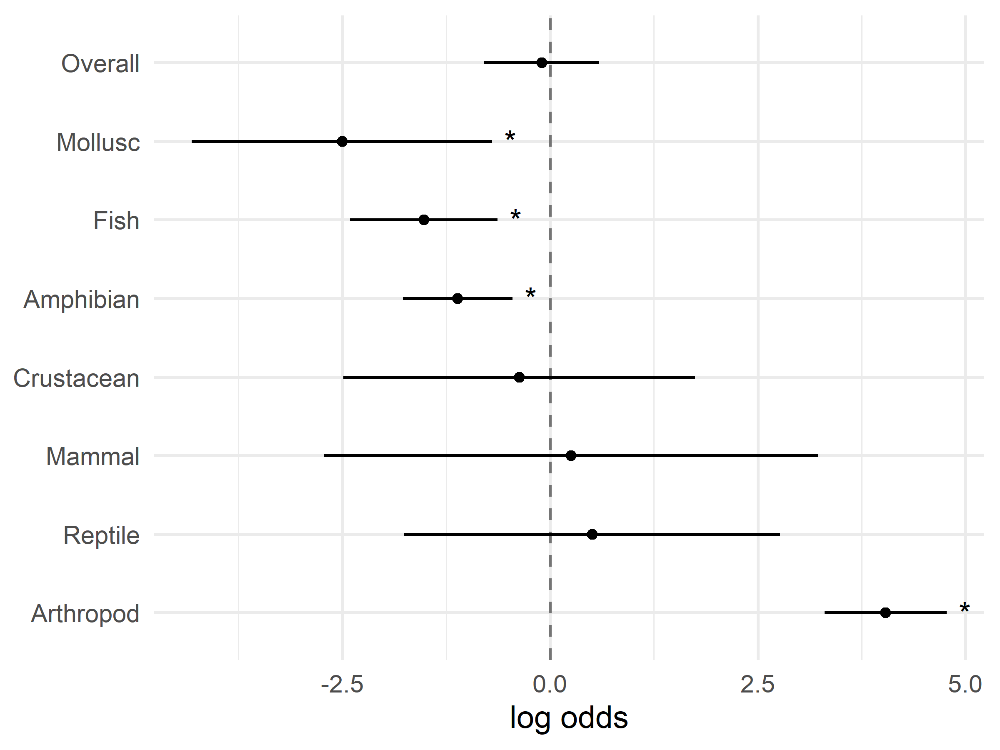<!-- -->

## Log-odds sample level

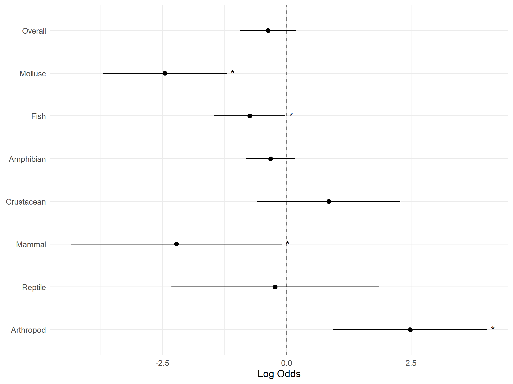<!-- -->

## Session Information

    R version 4.2.3 (2023-03-15 ucrt)
    Platform: x86_64-w64-mingw32/x64 (64-bit)
    Running under: Windows 10 x64 (build 26100)

    Matrix products: default

    locale:
    [1] LC_COLLATE=English_United States.utf8 
    [2] LC_CTYPE=English_United States.utf8   
    [3] LC_MONETARY=English_United States.utf8
    [4] LC_NUMERIC=C                          
    [5] LC_TIME=English_United States.utf8    

    attached base packages:
    [1] stats     graphics  grDevices utils     datasets  methods   base     

    other attached packages:
     [1] cowplot_1.1.3       lubridate_1.9.3     forcats_1.0.0      
     [4] stringr_1.5.1       dplyr_1.1.4         purrr_1.0.2        
     [7] readr_2.1.5         tidyr_1.3.1         tibble_3.2.1       
    [10] ggplot2_3.5.1       tidyverse_2.0.0     multcomp_1.4-25    
    [13] TH.data_1.1-2       MASS_7.3-58.2       survival_3.5-3     
    [16] mvtnorm_1.2-5       emmeans_1.10.2      DHARMa_0.4.7       
    [19] sjPlot_2.8.16       glmmTMB_1.1.9       metafor_4.8-0      
    [22] numDeriv_2016.8-1.1 metadat_1.4-0       Matrix_1.5-3       

    loaded via a namespace (and not attached):
     [1] Rcpp_1.0.12        lattice_0.20-45    zoo_1.8-12         rprojroot_2.0.4   
     [5] digest_0.6.35      utf8_1.2.4         R6_2.5.1           evaluate_0.24.0   
     [9] coda_0.19-4.1      pillar_1.9.0       rlang_1.1.4        rstudioapi_0.16.0 
    [13] minqa_1.2.7        performance_0.12.0 nloptr_2.0.3       rmarkdown_2.27    
    [17] mathjaxr_1.8-0     ggeffects_1.6.0    splines_4.2.3      lme4_1.1-35.3     
    [21] TMB_1.9.11         munsell_0.5.1      compiler_4.2.3     xfun_0.44         
    [25] pkgconfig_2.0.3    mgcv_1.8-42        htmltools_0.5.8.1  insight_1.0.1     
    [29] tidyselect_1.2.1   codetools_0.2-19   fansi_1.0.6        tzdb_0.4.0        
    [33] withr_3.0.0        sjmisc_2.8.10      grid_4.2.3         nlme_3.1-162      
    [37] xtable_1.8-4       gtable_0.3.5       lifecycle_1.0.4    magrittr_2.0.3    
    [41] scales_1.3.0       datawizard_0.11.0  stringi_1.8.4      estimability_1.5.1
    [45] cli_3.6.2          vctrs_0.6.5        generics_0.1.3     boot_1.3-28.1     
    [49] sandwich_3.1-0     sjlabelled_1.2.0   tools_4.2.3        glue_1.7.0        
    [53] hms_1.1.3          sjstats_0.19.0     fastmap_1.2.0      yaml_2.3.8        
    [57] timechange_0.3.0   colorspace_2.1-0   knitr_1.47        
