Detection Methods Meta-analysis
================
Dr. Riley M. Anderson & Taydin Macon
March 30, 2026

  

- [Overview](#overview)
  - [Summary of Results](#summary-of-results)
- [GLMM approach](#glmm-approach)
  - [Study-level analysis](#study-level-analysis)
  - [Study-level main figure:](#study-level-main-figure)
  - [Sample-level analysis:](#sample-level-analysis)
- [Log odds for study level
  analysis](#log-odds-for-study-level-analysis)
- [Log odds](#log-odds)
  - [Log odds study (site) level](#log-odds-study-site-level)
  - [Log-odds sample level](#log-odds-sample-level)
  - [Session Information](#session-information)

## Overview

A meta-analysis comparing detection probabilities of traditional and
eDNA methods.

### Summary of Results

- 

# GLMM approach

With a glmm we can account for within and across study variance and use
the direct counts from each study. No need for effect size and variance
estimation.

Moreover, if we can get a random slope to coverge, this approach exactly
mirrors that of a multilevel random-effects meta-analysis.

## Study-level analysis

    ## Data: d1
    ## Models:
    ## MODEL1: cbind(detections, misses) ~ detect_method + (1 | paper) + (1 | , zi=~0, disp=~1
    ## MODEL1:     study), zi=~0, disp=~1
    ## MODEL2: cbind(detections, misses) ~ detect_method + (1 | paper) + (1 | , zi=~0, disp=~1
    ## MODEL2:     study), zi=~0, disp=~1
    ## MODEL3: cbind(detections, misses) ~ detect_method + (1 | paper) + (1 + , zi=~0, disp=~1
    ## MODEL3:     detect_method | study), zi=~0, disp=~1
    ##        Df    AIC    BIC  logLik deviance Chisq Chi Df Pr(>Chisq)    
    ## MODEL1  4 1653.7 1667.4 -822.83   1645.7                            
    ## MODEL2  4 1653.7 1667.4 -822.83   1645.7   0.0      0          1    
    ## MODEL3  6 1240.4 1260.9 -614.18   1228.4 417.3      2     <2e-16 ***
    ## ---
    ## Signif. codes:  0 '***' 0.001 '**' 0.01 '*' 0.05 '.' 0.1 ' ' 1
    ##  Family: binomial  ( logit )
    ## Formula:          
    ## cbind(detections, misses) ~ detect_method + (1 | paper) + (1 +  
    ##     detect_method | study)
    ## Data: d1
    ## 
    ##       AIC       BIC    logLik -2*log(L)  df.resid 
    ##    1240.4    1260.9    -614.2    1228.4       222 
    ## 
    ## Random effects:
    ## 
    ## Conditional model:
    ##  Groups Name              Variance Std.Dev. Corr  
    ##  paper  (Intercept)       0.6068   0.779          
    ##  study  (Intercept)       1.9521   1.397          
    ##         detect_methodeDNA 2.7055   1.645    -0.28 
    ## Number of obs: 228, groups:  paper, 33; study, 114
    ## 
    ## Conditional model:
    ##                   Estimate Std. Error z value Pr(>|z|)    
    ## (Intercept)         0.1743     0.2257   0.772     0.44    
    ## detect_methodeDNA   0.7546     0.1879   4.015 5.94e-05 ***
    ## ---
    ## Signif. codes:  0 '***' 0.001 '**' 0.01 '*' 0.05 '.' 0.1 ' ' 1
    ##  Family: binomial  ( logit )
    ## Formula:          
    ## cbind(detections, misses) ~ detect_method * organism + scale(pub_year):detect_method +  
    ##     (1 | paper) + (1 + detect_method | study)
    ## Data: d1
    ## 
    ##       AIC       BIC    logLik -2*log(L)  df.resid 
    ##    1241.5    1310.1    -600.8    1201.5       208 
    ## 
    ## Random effects:
    ## 
    ## Conditional model:
    ##  Groups Name              Variance Std.Dev. Corr  
    ##  paper  (Intercept)       0.3347   0.5785         
    ##  study  (Intercept)       1.8550   1.3620         
    ##         detect_methodeDNA 2.2815   1.5105   -0.31 
    ## Number of obs: 228, groups:  paper, 33; study, 114
    ## 
    ## Conditional model:
    ##                                          Estimate Std. Error z value Pr(>|z|)
    ## (Intercept)                              -0.06454    0.33020  -0.196  0.84504
    ## detect_methodeDNA                         0.71923    0.25239   2.850  0.00438
    ## organismCrustacean                        0.57915    0.76055   0.761  0.44636
    ## organismFish                              0.53247    0.46181   1.153  0.24891
    ## organismInsect                           -0.42083    0.79073  -0.532  0.59458
    ## organismMammal                            1.10354    1.26678   0.871  0.38368
    ## organismMollusc                          -1.44587    0.76665  -1.886  0.05930
    ## organismReptile                          -0.69716    0.90230  -0.773  0.43973
    ## detect_methodeDNA:organismCrustacean     -0.47007    0.76907  -0.611  0.54105
    ## detect_methodeDNA:organismFish            0.51904    0.45170   1.149  0.25052
    ## detect_methodeDNA:organismInsect         -1.13171    0.80556  -1.405  0.16006
    ## detect_methodeDNA:organismMammal         -1.35876    1.21039  -1.123  0.26162
    ## detect_methodeDNA:organismMollusc         1.43112    0.77768   1.840  0.06573
    ## detect_methodeDNA:organismReptile        -1.17224    0.98008  -1.196  0.23167
    ## detect_methodTraditional:scale(pub_year) -0.36928    0.22371  -1.651  0.09880
    ## detect_methodeDNA:scale(pub_year)        -0.64284    0.25262  -2.545  0.01094
    ##                                            
    ## (Intercept)                                
    ## detect_methodeDNA                        **
    ## organismCrustacean                         
    ## organismFish                               
    ## organismInsect                             
    ## organismMammal                             
    ## organismMollusc                          . 
    ## organismReptile                            
    ## detect_methodeDNA:organismCrustacean       
    ## detect_methodeDNA:organismFish             
    ## detect_methodeDNA:organismInsect           
    ## detect_methodeDNA:organismMammal           
    ## detect_methodeDNA:organismMollusc        . 
    ## detect_methodeDNA:organismReptile          
    ## detect_methodTraditional:scale(pub_year) . 
    ## detect_methodeDNA:scale(pub_year)        * 
    ## ---
    ## Signif. codes:  0 '***' 0.001 '**' 0.01 '*' 0.05 '.' 0.1 ' ' 1
    ## Data: d1
    ## Models:
    ## study_mod3: cbind(detections, misses) ~ detect_method * organism + scale(pub_year) + , zi=~0, disp=~1
    ## study_mod3:     (1 | paper) + (1 + detect_method | study), zi=~0, disp=~1
    ## study_mod2: cbind(detections, misses) ~ detect_method * organism + scale(pub_year):detect_method + , zi=~0, disp=~1
    ## study_mod2:     (1 | paper) + (1 + detect_method | study), zi=~0, disp=~1
    ## study_mod4: cbind(detections, misses) ~ detect_method * organism + scale(pub_year):detect_method + , zi=~0, disp=~1
    ## study_mod4:     col_method_edna + (1 | paper) + (1 + detect_method | study), zi=~0, disp=~1
    ##            Df    AIC    BIC  logLik deviance  Chisq Chi Df Pr(>Chisq)
    ## study_mod3 19 1241.3 1306.5 -601.67   1203.3                         
    ## study_mod2 20 1241.5 1310.1 -600.77   1201.5 1.8029      1     0.1794
    ## study_mod4 20 1241.5 1310.1 -600.77   1201.5 0.0000      0     1.0000

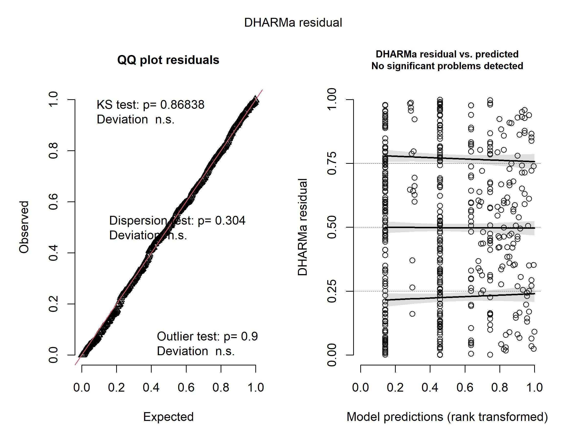<!-- -->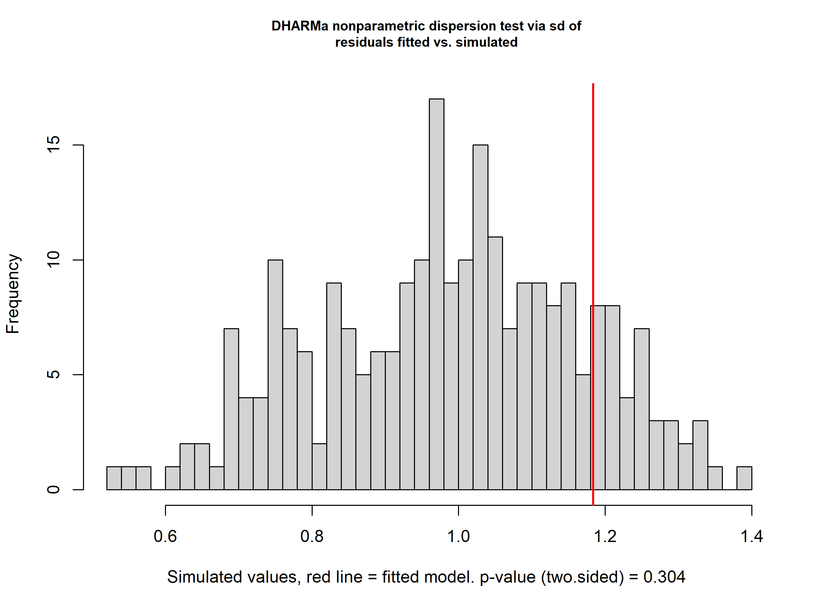<!-- -->

    ## 
    ##  DHARMa nonparametric dispersion test via sd of residuals fitted vs.
    ##  simulated
    ## 
    ## data:  simulationOutput
    ## dispersion = 1.2509, p-value = 0.24
    ## alternative hypothesis: two.sided

## Study-level main figure:

    ##  Family: binomial  ( logit )
    ## Formula:          
    ## cbind(detections, misses) ~ detect_method * organism + scale(pub_year):detect_method +  
    ##     (1 | paper) + (1 + detect_method | study)
    ## Data: d1
    ## 
    ##       AIC       BIC    logLik -2*log(L)  df.resid 
    ##    1241.5    1310.1    -600.8    1201.5       208 
    ## 
    ## Random effects:
    ## 
    ## Conditional model:
    ##  Groups Name              Variance Std.Dev. Corr  
    ##  paper  (Intercept)       0.3347   0.5785         
    ##  study  (Intercept)       1.8550   1.3620         
    ##         detect_methodeDNA 2.2815   1.5105   -0.31 
    ## Number of obs: 228, groups:  paper, 33; study, 114
    ## 
    ## Conditional model:
    ##                                          Estimate Std. Error z value Pr(>|z|)
    ## (Intercept)                              -0.06454    0.33020  -0.196  0.84504
    ## detect_methodeDNA                         0.71923    0.25239   2.850  0.00438
    ## organismCrustacean                        0.57915    0.76055   0.761  0.44636
    ## organismFish                              0.53247    0.46181   1.153  0.24891
    ## organismInsect                           -0.42083    0.79073  -0.532  0.59458
    ## organismMammal                            1.10354    1.26678   0.871  0.38368
    ## organismMollusc                          -1.44587    0.76665  -1.886  0.05930
    ## organismReptile                          -0.69716    0.90230  -0.773  0.43973
    ## detect_methodeDNA:organismCrustacean     -0.47007    0.76907  -0.611  0.54105
    ## detect_methodeDNA:organismFish            0.51904    0.45170   1.149  0.25052
    ## detect_methodeDNA:organismInsect         -1.13171    0.80556  -1.405  0.16006
    ## detect_methodeDNA:organismMammal         -1.35876    1.21039  -1.123  0.26162
    ## detect_methodeDNA:organismMollusc         1.43112    0.77768   1.840  0.06573
    ## detect_methodeDNA:organismReptile        -1.17224    0.98008  -1.196  0.23167
    ## detect_methodTraditional:scale(pub_year) -0.36928    0.22371  -1.651  0.09880
    ## detect_methodeDNA:scale(pub_year)        -0.64284    0.25262  -2.545  0.01094
    ##                                            
    ## (Intercept)                                
    ## detect_methodeDNA                        **
    ## organismCrustacean                         
    ## organismFish                               
    ## organismInsect                             
    ## organismMammal                             
    ## organismMollusc                          . 
    ## organismReptile                            
    ## detect_methodeDNA:organismCrustacean       
    ## detect_methodeDNA:organismFish             
    ## detect_methodeDNA:organismInsect           
    ## detect_methodeDNA:organismMammal           
    ## detect_methodeDNA:organismMollusc        . 
    ## detect_methodeDNA:organismReptile          
    ## detect_methodTraditional:scale(pub_year) . 
    ## detect_methodeDNA:scale(pub_year)        * 
    ## ---
    ## Signif. codes:  0 '***' 0.001 '**' 0.01 '*' 0.05 '.' 0.1 ' ' 1
    ## [[1]]

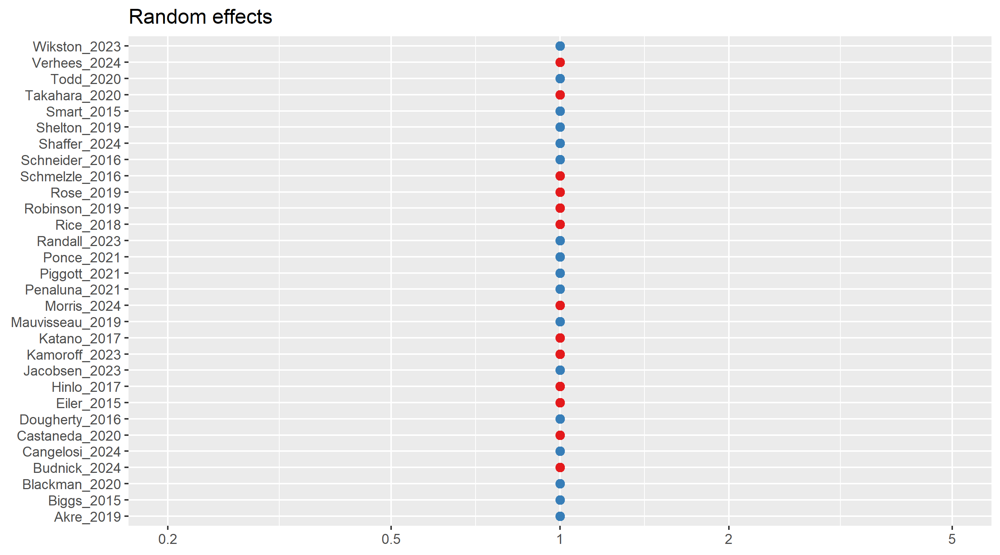<!-- -->

    ## 
    ## [[2]]

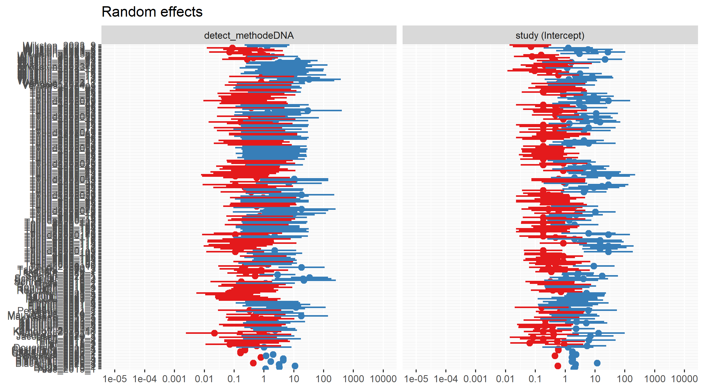<!-- -->
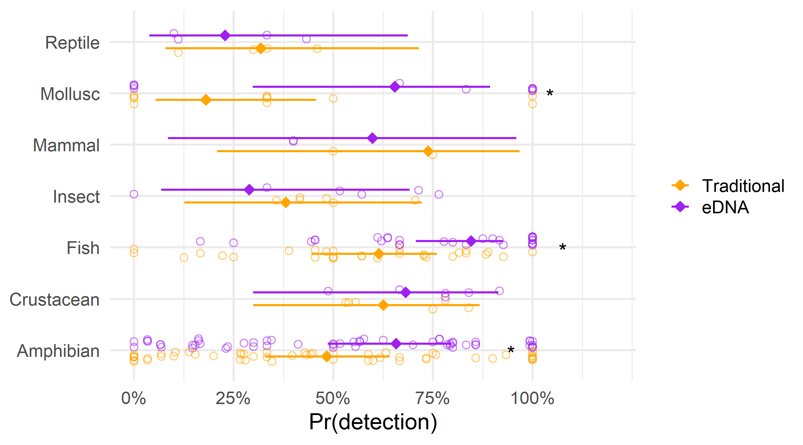<!-- -->

## Sample-level analysis:

    ##  Family: binomial  ( logit )
    ## Formula:          
    ## cbind(detections, misses) ~ detect_method + (1 | paper) + (1 |      study)
    ## Data: subset(d2, organism != "Hydrozoan")
    ## 
    ##       AIC       BIC    logLik -2*log(L)  df.resid 
    ##    2210.2    2222.4   -1101.1    2202.2       154 
    ## 
    ## Random effects:
    ## 
    ## Conditional model:
    ##  Groups Name        Variance Std.Dev.
    ##  paper  (Intercept) 0.7847   0.8858  
    ##  study  (Intercept) 2.2736   1.5078  
    ## Number of obs: 158, groups:  paper, 22; study, 79
    ## 
    ## Conditional model:
    ##                   Estimate Std. Error z value Pr(>|z|)    
    ## (Intercept)       -0.65675    0.30548  -2.150   0.0316 *  
    ## detect_methodeDNA  0.26061    0.04287   6.079 1.21e-09 ***
    ## ---
    ## Signif. codes:  0 '***' 0.001 '**' 0.01 '*' 0.05 '.' 0.1 ' ' 1
    ## Overdispersion ratio for model: mod9 
    ## formula: cbind(detections, misses) ~ detect_method * organism + scale(pub_year):detect_method + (1 | paper) + (1 + detect_method | study) 
    ## 
    ## Acceptable range: 1 - 1.4
    ## Overdispersion ratio: 0.19  df: 138  p = 1 
    ##  Data are NOT OVERDISPERSED
    ##    ratio deviance       df   pvalue 
    ##   0.1900  26.1635 138.0000   1.0000

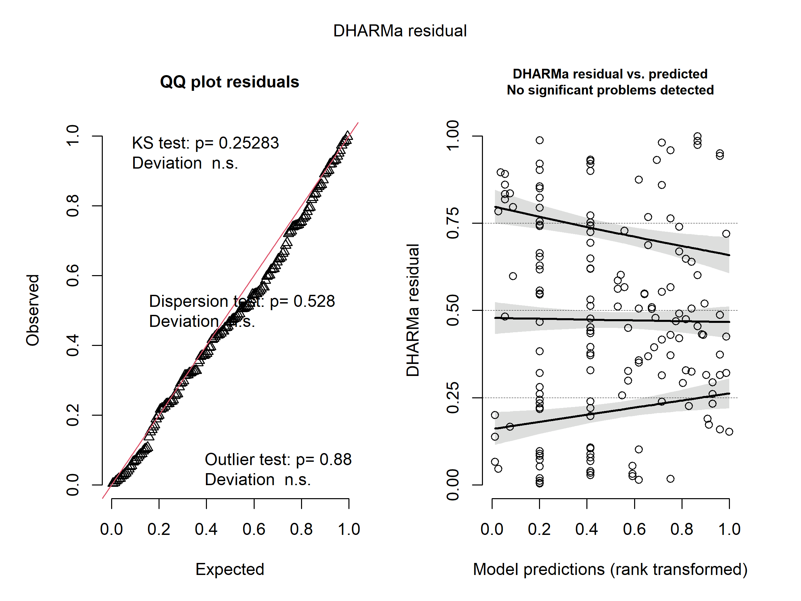<!-- -->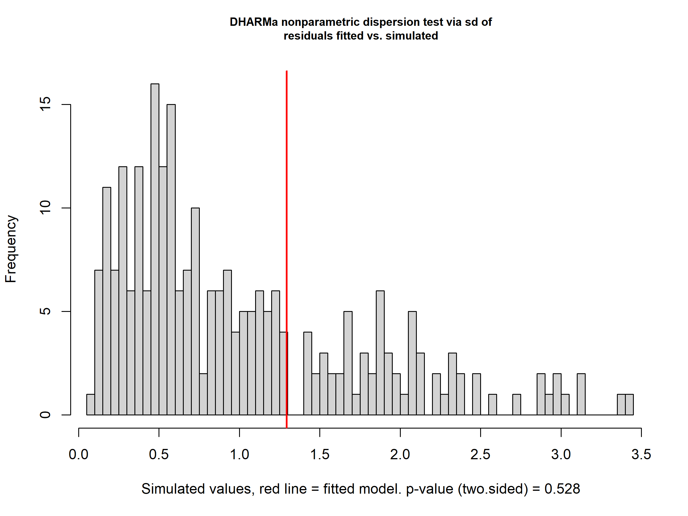<!-- -->

    ## 
    ##  DHARMa nonparametric dispersion test via sd of residuals fitted vs.
    ##  simulated
    ## 
    ## data:  simulationOutput
    ## dispersion = 0.77681, p-value = 0.72
    ## alternative hypothesis: two.sided
    ##  Family: binomial  ( logit )
    ## Formula:          
    ## cbind(detections, misses) ~ detect_method * organism + scale(pub_year):detect_method +  
    ##     (1 | paper) + (1 + detect_method | study)
    ## Data: subset(d2, organism != "Hydrozoan")
    ## 
    ##       AIC       BIC    logLik -2*log(L)  df.resid 
    ##    1228.0    1289.3    -594.0    1188.0       138 
    ## 
    ## Random effects:
    ## 
    ## Conditional model:
    ##  Groups Name              Variance Std.Dev. Corr  
    ##  paper  (Intercept)       0.3746   0.612          
    ##  study  (Intercept)       1.8534   1.361          
    ##         detect_methodeDNA 2.0819   1.443    -0.09 
    ## Number of obs: 158, groups:  paper, 22; study, 79
    ## 
    ## Conditional model:
    ##                                          Estimate Std. Error z value Pr(>|z|)
    ## (Intercept)                              -1.22448    0.42907  -2.854 0.004320
    ## detect_methodeDNA                         0.34300    0.25621   1.339 0.180646
    ## organismCrustacean                        0.70474    0.96930   0.727 0.467190
    ## organismFish                              1.17266    0.56573   2.073 0.038188
    ## organismInsect                            0.31851    0.92090   0.346 0.729443
    ## organismMammal                           -0.41511    1.27647  -0.325 0.745032
    ## organismMollusc                          -1.28250    0.85216  -1.505 0.132323
    ## organismReptile                           0.49531    1.12688   0.440 0.660271
    ## detect_methodeDNA:organismCrustacean     -0.97256    0.91427  -1.064 0.287441
    ## detect_methodeDNA:organismFish            0.30131    0.47407   0.636 0.525043
    ## detect_methodeDNA:organismInsect         -2.84081    0.85798  -3.311 0.000929
    ## detect_methodeDNA:organismMammal          1.90691    1.11848   1.705 0.088211
    ## detect_methodeDNA:organismMollusc         2.13912    0.69281   3.088 0.002018
    ## detect_methodeDNA:organismReptile        -0.09325    1.10923  -0.084 0.933001
    ## detect_methodTraditional:scale(pub_year) -0.56702    0.25982  -2.182 0.029083
    ## detect_methodeDNA:scale(pub_year)        -1.02106    0.31054  -3.288 0.001009
    ##                                             
    ## (Intercept)                              ** 
    ## detect_methodeDNA                           
    ## organismCrustacean                          
    ## organismFish                             *  
    ## organismInsect                              
    ## organismMammal                              
    ## organismMollusc                             
    ## organismReptile                             
    ## detect_methodeDNA:organismCrustacean        
    ## detect_methodeDNA:organismFish              
    ## detect_methodeDNA:organismInsect         ***
    ## detect_methodeDNA:organismMammal         .  
    ## detect_methodeDNA:organismMollusc        ** 
    ## detect_methodeDNA:organismReptile           
    ## detect_methodTraditional:scale(pub_year) *  
    ## detect_methodeDNA:scale(pub_year)        ** 
    ## ---
    ## Signif. codes:  0 '***' 0.001 '**' 0.01 '*' 0.05 '.' 0.1 ' ' 1

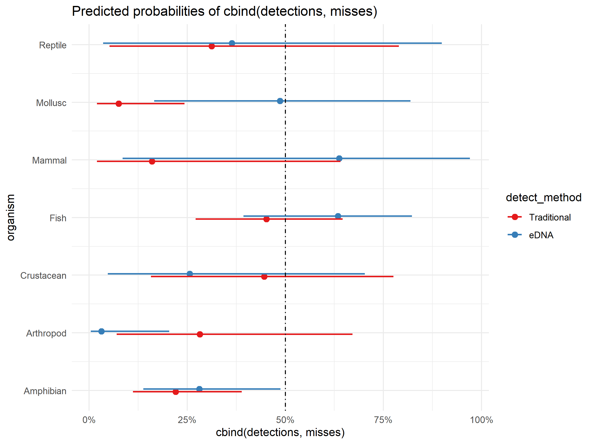<!-- -->

    ## organism = Amphibian:
    ##  contrast           estimate    SE  df z.ratio p.value
    ##  Traditional - eDNA   -0.343 0.256 Inf  -1.339  0.1806
    ## 
    ## organism = Crustacean:
    ##  contrast           estimate    SE  df z.ratio p.value
    ##  Traditional - eDNA    0.630 0.870 Inf   0.724  0.4691
    ## 
    ## organism = Fish:
    ##  contrast           estimate    SE  df z.ratio p.value
    ##  Traditional - eDNA   -0.644 0.396 Inf  -1.629  0.1034
    ## 
    ## organism = Insect:
    ##  contrast           estimate    SE  df z.ratio p.value
    ##  Traditional - eDNA    2.498 0.801 Inf   3.118  0.0018
    ## 
    ## organism = Mammal:
    ##  contrast           estimate    SE  df z.ratio p.value
    ##  Traditional - eDNA   -2.250 1.100 Inf  -2.049  0.0405
    ## 
    ## organism = Mollusc:
    ##  contrast           estimate    SE  df z.ratio p.value
    ##  Traditional - eDNA   -2.482 0.646 Inf  -3.842  0.0001
    ## 
    ## organism = Reptile:
    ##  contrast           estimate    SE  df z.ratio p.value
    ##  Traditional - eDNA   -0.250 1.080 Inf  -0.232  0.8168
    ## 
    ## Results are given on the log odds ratio (not the response) scale.

    ##  Family: binomial  ( logit )
    ## Formula:          
    ## cbind(detections, misses) ~ detect_method * organism + scale(pub_year):detect_method +  
    ##     (1 | paper) + (1 + detect_method | study)
    ## Data: subset(d2, organism != "Hydrozoan")
    ## 
    ##       AIC       BIC    logLik -2*log(L)  df.resid 
    ##    1228.0    1289.3    -594.0    1188.0       138 
    ## 
    ## Random effects:
    ## 
    ## Conditional model:
    ##  Groups Name              Variance Std.Dev. Corr  
    ##  paper  (Intercept)       0.3746   0.612          
    ##  study  (Intercept)       1.8534   1.361          
    ##         detect_methodeDNA 2.0819   1.443    -0.09 
    ## Number of obs: 158, groups:  paper, 22; study, 79
    ## 
    ## Conditional model:
    ##                                          Estimate Std. Error z value Pr(>|z|)
    ## (Intercept)                              -1.22448    0.42907  -2.854 0.004320
    ## detect_methodeDNA                         0.34300    0.25621   1.339 0.180646
    ## organismCrustacean                        0.70474    0.96930   0.727 0.467190
    ## organismFish                              1.17266    0.56573   2.073 0.038188
    ## organismInsect                            0.31851    0.92090   0.346 0.729443
    ## organismMammal                           -0.41511    1.27647  -0.325 0.745032
    ## organismMollusc                          -1.28250    0.85216  -1.505 0.132323
    ## organismReptile                           0.49531    1.12688   0.440 0.660271
    ## detect_methodeDNA:organismCrustacean     -0.97256    0.91427  -1.064 0.287441
    ## detect_methodeDNA:organismFish            0.30131    0.47407   0.636 0.525043
    ## detect_methodeDNA:organismInsect         -2.84081    0.85798  -3.311 0.000929
    ## detect_methodeDNA:organismMammal          1.90691    1.11848   1.705 0.088211
    ## detect_methodeDNA:organismMollusc         2.13912    0.69281   3.088 0.002018
    ## detect_methodeDNA:organismReptile        -0.09325    1.10923  -0.084 0.933001
    ## detect_methodTraditional:scale(pub_year) -0.56702    0.25982  -2.182 0.029083
    ## detect_methodeDNA:scale(pub_year)        -1.02106    0.31054  -3.288 0.001009
    ##                                             
    ## (Intercept)                              ** 
    ## detect_methodeDNA                           
    ## organismCrustacean                          
    ## organismFish                             *  
    ## organismInsect                              
    ## organismMammal                              
    ## organismMollusc                             
    ## organismReptile                             
    ## detect_methodeDNA:organismCrustacean        
    ## detect_methodeDNA:organismFish              
    ## detect_methodeDNA:organismInsect         ***
    ## detect_methodeDNA:organismMammal         .  
    ## detect_methodeDNA:organismMollusc        ** 
    ## detect_methodeDNA:organismReptile           
    ## detect_methodTraditional:scale(pub_year) *  
    ## detect_methodeDNA:scale(pub_year)        ** 
    ## ---
    ## Signif. codes:  0 '***' 0.001 '**' 0.01 '*' 0.05 '.' 0.1 ' ' 1
    ## [[1]]

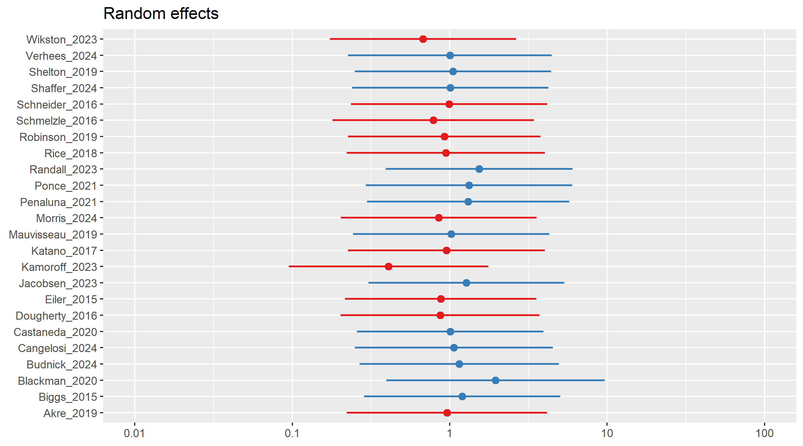<!-- -->

    ## 
    ## [[2]]

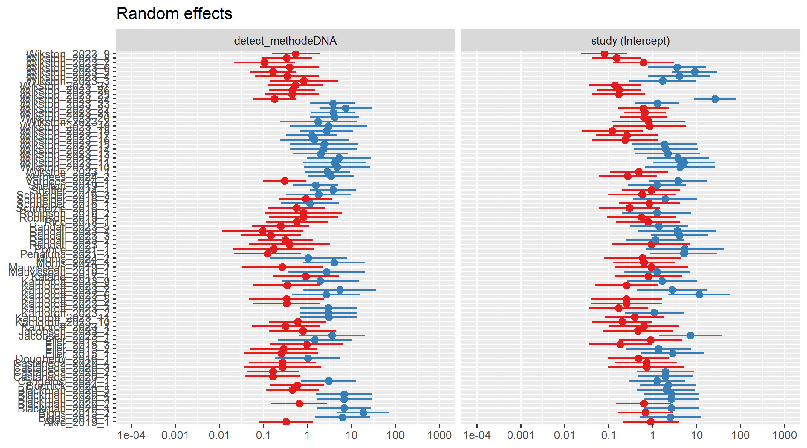<!-- -->
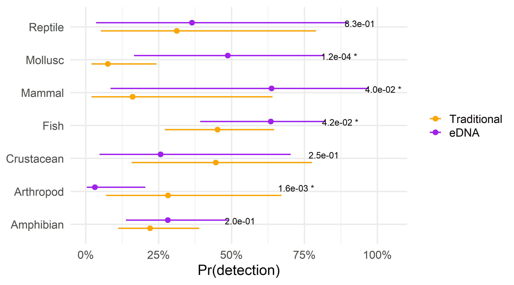<!-- -->

    ##  contrast           odds.ratio         SE  df null z.ratio p.value
    ##  Traditional / eDNA  0.7705801 0.03303626 Inf    1  -6.079 <0.0001
    ## 
    ## Tests are performed on the log odds ratio scale

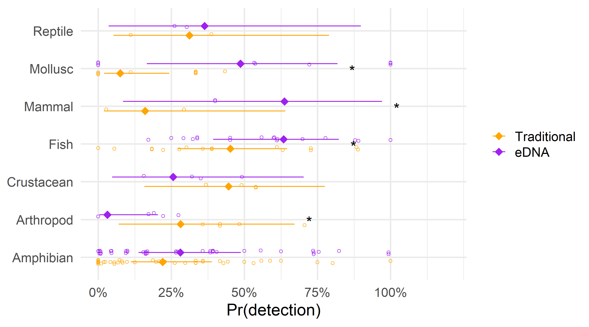<!-- -->

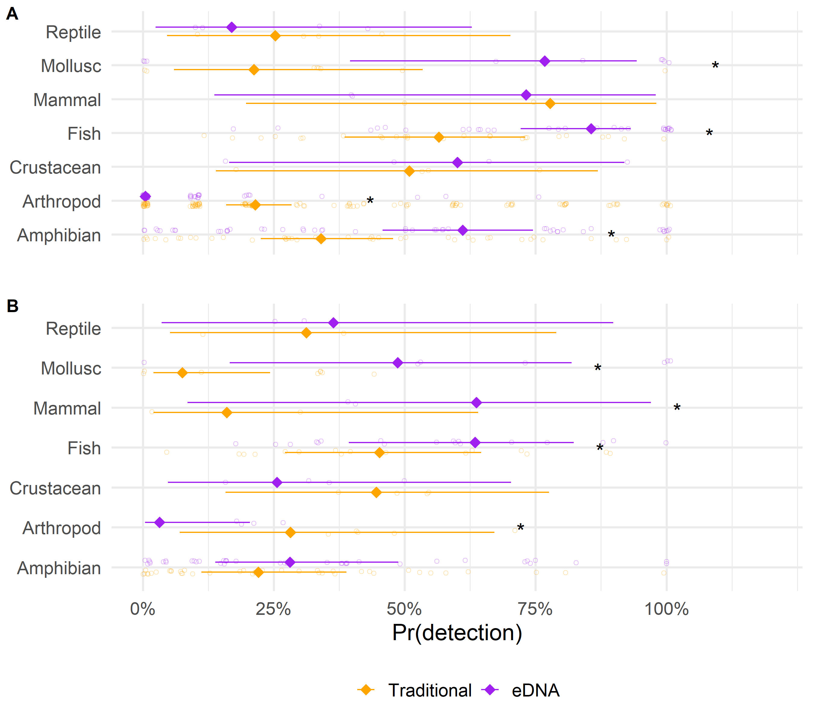<!-- -->

- **A** is the study-level figure, **B** is the sample-level figure. ^^

<!-- -->

    ##  Family: binomial  ( logit )
    ## Formula:          
    ## cbind(detections, misses) ~ Methods * organism + (1 | paper) +      (1 | study)
    ## Data: d1_trad
    ## 
    ##       AIC       BIC    logLik -2*log(L)  df.resid 
    ##     648.7     684.3    -311.4     622.7       101 
    ## 
    ## Random effects:
    ## 
    ## Conditional model:
    ##  Groups Name        Variance Std.Dev.
    ##  paper  (Intercept) 0.5541   0.7444  
    ##  study  (Intercept) 1.6732   1.2935  
    ## Number of obs: 114, groups:  paper, 33; study, 114
    ## 
    ## Conditional model:
    ##                                   Estimate Std. Error z value Pr(>|z|)  
    ## (Intercept)                        0.36585    0.41221   0.887   0.3748  
    ## MethodsPassive                    -0.33683    0.69858  -0.482   0.6297  
    ## organismCrustacean                 0.50202    0.91784   0.547   0.5844  
    ## organismFish                       0.22691    0.55524   0.409   0.6828  
    ## organismInsect                    -0.45391    0.84014  -0.540   0.5890  
    ## organismMammal                     0.53939    1.38867   0.388   0.6977  
    ## organismMollusc                   -1.46059    0.78609  -1.858   0.0632 .
    ## organismReptile                   -0.40730    1.18059  -0.345   0.7301  
    ## MethodsPassive:organismCrustacean -0.06477    1.45445  -0.044   0.9645  
    ## MethodsPassive:organismFish        0.06409    1.00141   0.064   0.9490  
    ## MethodsPassive:organismInsect           NA         NA      NA       NA  
    ## MethodsPassive:organismMammal           NA         NA      NA       NA  
    ## MethodsPassive:organismMollusc          NA         NA      NA       NA  
    ## MethodsPassive:organismReptile    -1.17806    1.87892  -0.627   0.5307  
    ## ---
    ## Signif. codes:  0 '***' 0.001 '**' 0.01 '*' 0.05 '.' 0.1 ' ' 1

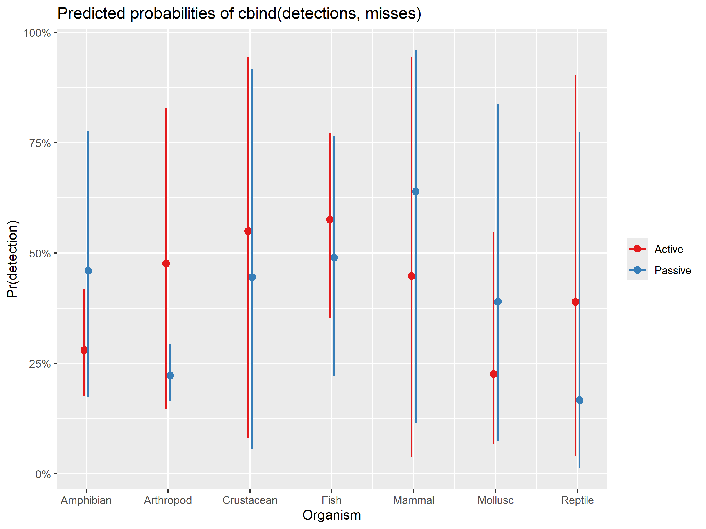<!-- -->

# Log odds for study level analysis

# Log odds

## Log odds study (site) level

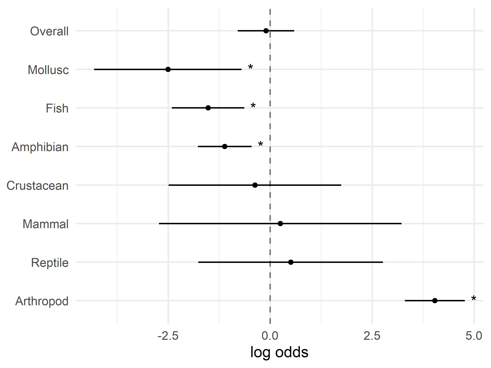<!-- -->

## Log-odds sample level

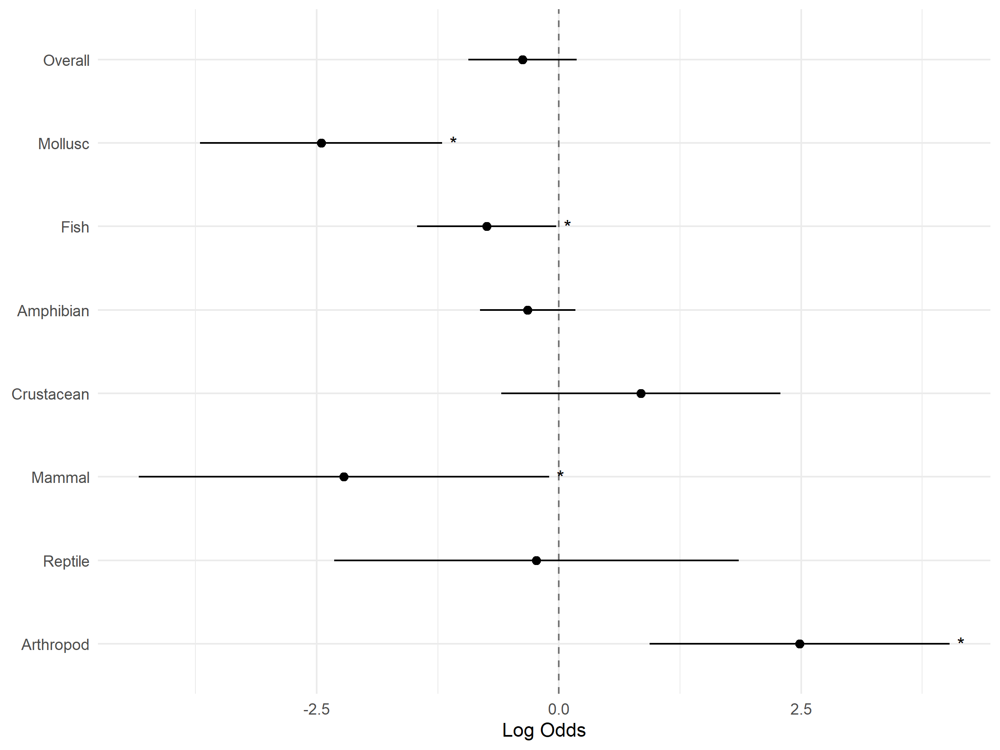<!-- -->

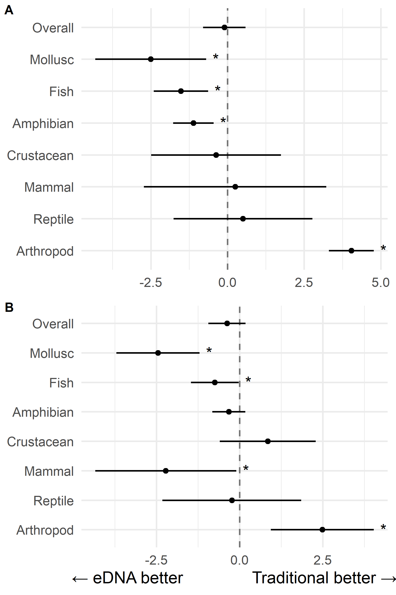<!-- -->

## Session Information

    R version 4.5.2 (2025-10-31 ucrt)
    Platform: x86_64-w64-mingw32/x64
    Running under: Windows 11 x64 (build 26200)

    Matrix products: default
      LAPACK version 3.12.1

    locale:
    [1] LC_COLLATE=English_United States.utf8 
    [2] LC_CTYPE=English_United States.utf8   
    [3] LC_MONETARY=English_United States.utf8
    [4] LC_NUMERIC=C                          
    [5] LC_TIME=English_United States.utf8    

    time zone: America/New_York
    tzcode source: internal

    attached base packages:
    [1] stats     graphics  grDevices utils     datasets  methods   base     

    other attached packages:
     [1] multcompView_0.1-11 cowplot_1.2.0       lubridate_1.9.4    
     [4] forcats_1.0.1       stringr_1.6.0       dplyr_1.1.4        
     [7] purrr_1.2.1         readr_2.1.6         tidyr_1.3.2        
    [10] tibble_3.3.1        ggplot2_4.0.2       tidyverse_2.0.0    
    [13] multcomp_1.4-29     TH.data_1.1-5       MASS_7.3-65        
    [16] survival_3.8-3      mvtnorm_1.3-3       emmeans_2.0.1      
    [19] DHARMa_0.4.7        sjPlot_2.9.0        glmmTMB_1.1.14     
    [22] metafor_4.8-0       numDeriv_2016.8-1.1 metadat_1.4-0      
    [25] Matrix_1.7-4       

    loaded via a namespace (and not attached):
     [1] sjlabelled_1.2.0   tidyselect_1.2.1   farver_2.1.2       S7_0.2.1          
     [5] fastmap_1.2.0      mathjaxr_2.0-0     promises_1.5.0     digest_0.6.39     
     [9] mime_0.13          estimability_1.5.1 timechange_0.4.0   lifecycle_1.0.5   
    [13] magrittr_2.0.4     compiler_4.5.2     rlang_1.1.7        tools_4.5.2       
    [17] yaml_2.3.12        knitr_1.51         labeling_0.4.3     plyr_1.8.9        
    [21] RColorBrewer_1.1-3 gap.datasets_0.0.6 withr_3.0.2        datawizard_1.3.0  
    [25] grid_4.5.2         xtable_1.8-8       scales_1.4.0       iterators_1.0.14  
    [29] insight_1.4.6      cli_3.6.5          rmarkdown_2.30     reformulas_0.4.4  
    [33] generics_0.1.4     otel_0.2.0         rstudioapi_0.18.0  tzdb_0.5.0        
    [37] minqa_1.2.8        splines_4.5.2      parallel_4.5.2     vctrs_0.7.1       
    [41] boot_1.3-32        sandwich_3.1-1     hms_1.1.4          qgam_2.0.0        
    [45] foreach_1.5.2      gap_1.14           glue_1.8.0         nloptr_2.2.1      
    [49] codetools_0.2-20   stringi_1.8.7      gtable_0.3.6       later_1.4.7       
    [53] ggeffects_2.3.2    lme4_1.1-38        pillar_1.11.1      htmltools_0.5.9   
    [57] R6_2.6.1           TMB_1.9.19         Rdpack_2.6.5       doParallel_1.0.17 
    [61] rprojroot_2.1.1    shiny_1.13.0       evaluate_1.0.5     lattice_0.22-7    
    [65] haven_2.5.5        rbibutils_2.4.1    httpuv_1.6.16      Rcpp_1.1.1        
    [69] coda_0.19-4.1      nlme_3.1-168       mgcv_1.9-4         xfun_0.56         
    [73] sjmisc_2.8.11      zoo_1.8-15         pkgconfig_2.0.3   
