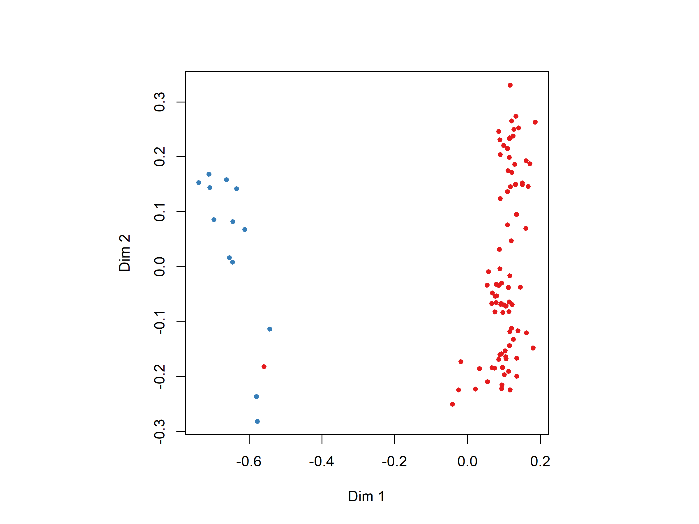
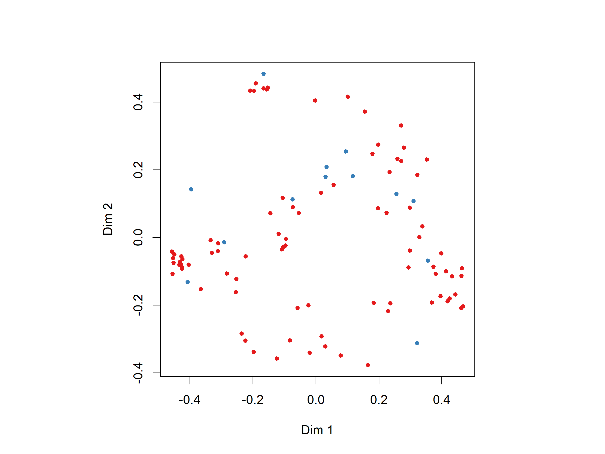

Taydin’s Pesticide Analysis
================
Dr. Riley M. Anderson & Taydin R. Macon
January 31, 2025

  

- [Overview](#overview)
  - [Summary of Results](#summary-of-results)
- [Session Information](#session-information)

## Overview

What is this analysis about?

### Summary of Results

- 

<!-- -->

    ## 
    ## Call:
    ##  randomForest(x = select(dat3, -mortality, -sample_number, -date,      -latitude, -longitude), y = dat3$mortality, importance = T,      nPerm = 999, proximity = T) 
    ##                Type of random forest: classification
    ##                      Number of trees: 500
    ## No. of variables tried at each split: 7
    ## 
    ##         OOB estimate of  error rate: 0.99%
    ## Confusion matrix:
    ##       Alive Dead class.error
    ## Alive    87    1  0.01136364
    ## Dead      0   13  0.00000000
    ## Random Forest 
    ## 
    ## 101 samples
    ##  59 predictor
    ##   2 classes: 'Alive', 'Dead' 
    ## 
    ## No pre-processing
    ## Resampling: Bootstrapped (25 reps) 
    ## Summary of sample sizes: 101, 101, 101, 101, 101, 101, ... 
    ## Resampling results across tuning parameters:
    ## 
    ##   mtry  Accuracy   Kappa    
    ##    2    0.8957068  0.1591964
    ##   30    0.8259779  0.2819187
    ##   59    0.8654523  0.3676967
    ## 
    ## Accuracy was used to select the optimal model using the largest value.
    ## The final value used for the model was mtry = 2.
    ## 
    ## Call:
    ##  randomForest(x = select(dat3, -mortality, -sample_number, -date,      -latitude, -longitude), y = dat3$mortality, mtry = 2, importance = T,      nPerm = 999, proximity = T) 
    ##                Type of random forest: classification
    ##                      Number of trees: 500
    ## No. of variables tried at each split: 2
    ## 
    ##         OOB estimate of  error rate: 7.92%
    ## Confusion matrix:
    ##       Alive Dead class.error
    ## Alive    88    0   0.0000000
    ## Dead      8    5   0.6153846
    ##                           Alive        Dead MeanDecreaseAccuracy
    ## Group.Population.ID  14.1787094 14.21689971           15.5838223
    ## population           13.9799737 15.18317300           14.8197794
    ## Cyprodinil            6.0992295  3.45026545            6.1909716
    ## crop                  6.6060609  2.10820978            6.6832453
    ## Tebuconazole          6.1275760  3.93526870            6.6457922
    ## group                 6.2474463 -0.47936447            5.8468446
    ## sample_ID             4.2280502  0.07958708            3.9923012
    ## Fluopyram             3.5499377  2.15516259            3.9789805
    ## Fluxapyroxad          1.4539053  0.33345862            1.3394722
    ## beekeeper             4.6789056  3.19222528            4.8162186
    ## month                 2.7280509  1.75496094            3.1126680
    ## Dimethoate            0.0000000  0.00000000            0.0000000
    ## Azoxystrobin          0.5756628 -0.58445010            0.1348334
    ## Boscalid              2.7764083 -0.71317264            2.1076229
    ## Propiconazole         0.9693339 -1.50991304            0.2768929
    ## Trifloxystrobin       3.3824918 -0.36748349            2.6494152
    ## stage                 3.4451752  2.30578850            3.8713554
    ## Buprofezin            0.9440525 -0.66501977            0.6888696
    ## Pendimethalin         2.4673760  1.11884297            2.7827908
    ## Thiophanate.methyl    2.4143709  0.57973756            2.7189468
    ## Diphenylamine         1.4848064  1.95725833            1.9847237
    ## year                  4.0407859  1.22967287            4.1010595
    ## tau.Fluvalinate       0.0000000  0.00000000            0.0000000
    ## Flutriafol            2.0424535  2.72047269            2.8549338
    ## Chlorantraniliprole   0.9379334  0.90430106            1.3060362
    ## state                 1.4375961  3.50941484            2.7898831
    ## Carbaryl              0.9619485 -0.80568124            0.5577596
    ## Pyrimethanil          1.0010015  2.38137898            2.0958742
    ## Pyraclostrobin        0.0355470  0.22751384            0.2773745
    ## Chlorpyrifos         -0.4573319  0.00000000           -0.5649128
    ## Triflumizole          2.4648838  0.00000000            2.4645537
    ## Penthiopyrad          1.7331099  0.00000000            1.7366823
    ## Diazinon              2.3805966  1.38942504            2.5474545
    ## Atrazine             -0.9521651 -1.00100150           -1.2562007
    ## Myclobutanil         -0.4335798  1.87717009            1.2431020
    ## Spinetoram.A          0.3883487  0.00000000            0.4182226
    ## Norflurazon           2.0981586  1.40834896            2.1485975
    ## Acetamiprid           2.0943354  0.00000000            2.0864562
    ## Difenoconazole        1.0010015  0.00000000            1.0010015
    ## Pyriproxyfen          1.4170505  0.00000000            1.4169365
    ## S.Metolachlor         1.4170505  0.00000000            1.4170505
    ## Cyflufenamid          1.2961641  0.00000000            1.2553784
    ## Flonicamid            0.0000000  0.00000000            0.0000000
    ## Fenbuconazole         0.0000000  0.00000000            0.0000000
    ## Fludioxonil           0.0000000  0.00000000            0.0000000
    ## Benzovindiflupyr      0.0000000  0.00000000            0.0000000
    ## Imidacloprid          0.0000000  0.00000000            0.0000000
    ## Hexythiazox           0.0000000  0.00000000            0.0000000
    ## Spiromesifen          0.0000000  0.00000000            0.0000000
    ## Acibenzolar.S.Methyl  1.0010015  0.00000000            1.0010015
    ## Trifluralin           0.0000000  0.00000000            0.0000000
    ## Propargite            0.0000000  0.00000000            0.0000000
    ## Sulfoxaflor           0.0000000  0.00000000            0.0000000
    ## Carbendazim           0.0000000  0.00000000            0.0000000
    ## Bifenthrin            0.0000000  0.00000000            0.0000000
    ## Methoxyfenozide       0.0000000  0.00000000            0.0000000
    ## Diflubenzuron         0.0000000  0.00000000            0.0000000
    ## Diuron                0.0000000  0.00000000            0.0000000
    ## Coumaphos             0.0000000  0.00000000            0.0000000
    ##                      MeanDecreaseGini
    ## Group.Population.ID      6.621711e+00
    ## population               5.823290e+00
    ## Cyprodinil               1.266569e+00
    ## crop                     1.236893e+00
    ## Tebuconazole             8.572826e-01
    ## group                    7.110228e-01
    ## sample_ID                5.352339e-01
    ## Fluopyram                3.640289e-01
    ## Fluxapyroxad             3.101214e-01
    ## beekeeper                3.079067e-01
    ## month                    2.878109e-01
    ## Dimethoate               2.521307e-01
    ## Azoxystrobin             2.420130e-01
    ## Boscalid                 2.365745e-01
    ## Propiconazole            2.280180e-01
    ## Trifloxystrobin          2.094459e-01
    ## stage                    2.092285e-01
    ## Buprofezin               2.006571e-01
    ## Pendimethalin            1.964353e-01
    ## Thiophanate.methyl       1.890616e-01
    ## Diphenylamine            1.714531e-01
    ## year                     1.681312e-01
    ## tau.Fluvalinate          1.580601e-01
    ## Flutriafol               1.576160e-01
    ## Chlorantraniliprole      1.280964e-01
    ## state                    1.240610e-01
    ## Carbaryl                 1.123181e-01
    ## Pyrimethanil             7.567256e-02
    ## Pyraclostrobin           5.832162e-02
    ## Chlorpyrifos             5.732270e-02
    ## Triflumizole             5.191717e-02
    ## Penthiopyrad             4.339477e-02
    ## Diazinon                 4.089274e-02
    ## Atrazine                 3.862342e-02
    ## Myclobutanil             3.762489e-02
    ## Spinetoram.A             3.175458e-02
    ## Norflurazon              2.931729e-02
    ## Acetamiprid              2.799571e-02
    ## Difenoconazole           2.364286e-02
    ## Pyriproxyfen             1.453285e-02
    ## S.Metolachlor            1.404542e-02
    ## Cyflufenamid             1.305711e-02
    ## Flonicamid               8.278112e-03
    ## Fenbuconazole            7.798880e-03
    ## Fludioxonil              4.025990e-03
    ## Benzovindiflupyr         3.601098e-03
    ## Imidacloprid             2.666667e-03
    ## Hexythiazox              2.387106e-03
    ## Spiromesifen             2.095238e-03
    ## Acibenzolar.S.Methyl     2.000000e-03
    ## Trifluralin              1.989683e-03
    ## Propargite               1.736631e-03
    ## Sulfoxaflor              7.394456e-04
    ## Carbendazim              2.048205e-04
    ## Bifenthrin               4.093817e-05
    ## Methoxyfenozide          4.000000e-05
    ## Diflubenzuron            3.636364e-05
    ## Diuron                   0.000000e+00
    ## Coumaphos                0.000000e+00

|                     |  Alive |   Dead | MeanDecreaseAccuracy | MeanDecreaseGini |
|:--------------------|-------:|-------:|---------------------:|-----------------:|
| Group.Population.ID | 14.179 | 14.217 |               15.584 |            6.622 |
| population          | 13.980 | 15.183 |               14.820 |            5.823 |
| Cyprodinil          |  6.099 |  3.450 |                6.191 |            1.267 |
| crop                |  6.606 |  2.108 |                6.683 |            1.237 |
| Tebuconazole        |  6.128 |  3.935 |                6.646 |            0.857 |
| group               |  6.247 | -0.479 |                5.847 |            0.711 |

<!-- -->

    ## 
    ## Call:
    ##  randomForest(x = select(dat3, Acibenzolar.S.Methyl:tau.Fluvalinate),      y = dat3$mortality, importance = T, nPerm = 999, proximity = T) 
    ##                Type of random forest: classification
    ##                      Number of trees: 500
    ## No. of variables tried at each split: 7
    ## 
    ##         OOB estimate of  error rate: 9.9%
    ## Confusion matrix:
    ##       Alive Dead class.error
    ## Alive    88    0   0.0000000
    ## Dead     10    3   0.7692308
    ## Random Forest 
    ## 
    ## 101 samples
    ##  49 predictor
    ##   2 classes: 'Alive', 'Dead' 
    ## 
    ## No pre-processing
    ## Resampling: Bootstrapped (25 reps) 
    ## Summary of sample sizes: 101, 101, 101, 101, 101, 101, ... 
    ## Resampling results across tuning parameters:
    ## 
    ##   mtry  Accuracy   Kappa    
    ##    2    0.8859476  0.0000000
    ##   25    0.8630931  0.2076758
    ##   49    0.8504279  0.1938539
    ## 
    ## Accuracy was used to select the optimal model using the largest value.
    ## The final value used for the model was mtry = 2.
    ## 
    ## Call:
    ##  randomForest(x = select(dat3, Acibenzolar.S.Methyl:tau.Fluvalinate),      y = dat3$mortality, mtry = 2, importance = T, nPerm = 999,      proximity = T) 
    ##                Type of random forest: classification
    ##                      Number of trees: 500
    ## No. of variables tried at each split: 2
    ## 
    ##         OOB estimate of  error rate: 12.87%
    ## Confusion matrix:
    ##       Alive Dead class.error
    ## Alive    88    0           0
    ## Dead     13    0           1
    ##                           Alive        Dead MeanDecreaseAccuracy
    ## Group.Population.ID  14.1787094 14.21689971           15.5838223
    ## population           13.9799737 15.18317300           14.8197794
    ## Cyprodinil            6.0992295  3.45026545            6.1909716
    ## crop                  6.6060609  2.10820978            6.6832453
    ## Tebuconazole          6.1275760  3.93526870            6.6457922
    ## group                 6.2474463 -0.47936447            5.8468446
    ## sample_ID             4.2280502  0.07958708            3.9923012
    ## Fluopyram             3.5499377  2.15516259            3.9789805
    ## Fluxapyroxad          1.4539053  0.33345862            1.3394722
    ## beekeeper             4.6789056  3.19222528            4.8162186
    ## month                 2.7280509  1.75496094            3.1126680
    ## Dimethoate            0.0000000  0.00000000            0.0000000
    ## Azoxystrobin          0.5756628 -0.58445010            0.1348334
    ## Boscalid              2.7764083 -0.71317264            2.1076229
    ## Propiconazole         0.9693339 -1.50991304            0.2768929
    ## Trifloxystrobin       3.3824918 -0.36748349            2.6494152
    ## stage                 3.4451752  2.30578850            3.8713554
    ## Buprofezin            0.9440525 -0.66501977            0.6888696
    ## Pendimethalin         2.4673760  1.11884297            2.7827908
    ## Thiophanate.methyl    2.4143709  0.57973756            2.7189468
    ## Diphenylamine         1.4848064  1.95725833            1.9847237
    ## year                  4.0407859  1.22967287            4.1010595
    ## tau.Fluvalinate       0.0000000  0.00000000            0.0000000
    ## Flutriafol            2.0424535  2.72047269            2.8549338
    ## Chlorantraniliprole   0.9379334  0.90430106            1.3060362
    ## state                 1.4375961  3.50941484            2.7898831
    ## Carbaryl              0.9619485 -0.80568124            0.5577596
    ## Pyrimethanil          1.0010015  2.38137898            2.0958742
    ## Pyraclostrobin        0.0355470  0.22751384            0.2773745
    ## Chlorpyrifos         -0.4573319  0.00000000           -0.5649128
    ## Triflumizole          2.4648838  0.00000000            2.4645537
    ## Penthiopyrad          1.7331099  0.00000000            1.7366823
    ## Diazinon              2.3805966  1.38942504            2.5474545
    ## Atrazine             -0.9521651 -1.00100150           -1.2562007
    ## Myclobutanil         -0.4335798  1.87717009            1.2431020
    ## Spinetoram.A          0.3883487  0.00000000            0.4182226
    ## Norflurazon           2.0981586  1.40834896            2.1485975
    ## Acetamiprid           2.0943354  0.00000000            2.0864562
    ## Difenoconazole        1.0010015  0.00000000            1.0010015
    ## Pyriproxyfen          1.4170505  0.00000000            1.4169365
    ## S.Metolachlor         1.4170505  0.00000000            1.4170505
    ## Cyflufenamid          1.2961641  0.00000000            1.2553784
    ## Flonicamid            0.0000000  0.00000000            0.0000000
    ## Fenbuconazole         0.0000000  0.00000000            0.0000000
    ## Fludioxonil           0.0000000  0.00000000            0.0000000
    ## Benzovindiflupyr      0.0000000  0.00000000            0.0000000
    ## Imidacloprid          0.0000000  0.00000000            0.0000000
    ## Hexythiazox           0.0000000  0.00000000            0.0000000
    ## Spiromesifen          0.0000000  0.00000000            0.0000000
    ## Acibenzolar.S.Methyl  1.0010015  0.00000000            1.0010015
    ## Trifluralin           0.0000000  0.00000000            0.0000000
    ## Propargite            0.0000000  0.00000000            0.0000000
    ## Sulfoxaflor           0.0000000  0.00000000            0.0000000
    ## Carbendazim           0.0000000  0.00000000            0.0000000
    ## Bifenthrin            0.0000000  0.00000000            0.0000000
    ## Methoxyfenozide       0.0000000  0.00000000            0.0000000
    ## Diflubenzuron         0.0000000  0.00000000            0.0000000
    ## Diuron                0.0000000  0.00000000            0.0000000
    ## Coumaphos             0.0000000  0.00000000            0.0000000
    ##                      MeanDecreaseGini
    ## Group.Population.ID      6.621711e+00
    ## population               5.823290e+00
    ## Cyprodinil               1.266569e+00
    ## crop                     1.236893e+00
    ## Tebuconazole             8.572826e-01
    ## group                    7.110228e-01
    ## sample_ID                5.352339e-01
    ## Fluopyram                3.640289e-01
    ## Fluxapyroxad             3.101214e-01
    ## beekeeper                3.079067e-01
    ## month                    2.878109e-01
    ## Dimethoate               2.521307e-01
    ## Azoxystrobin             2.420130e-01
    ## Boscalid                 2.365745e-01
    ## Propiconazole            2.280180e-01
    ## Trifloxystrobin          2.094459e-01
    ## stage                    2.092285e-01
    ## Buprofezin               2.006571e-01
    ## Pendimethalin            1.964353e-01
    ## Thiophanate.methyl       1.890616e-01
    ## Diphenylamine            1.714531e-01
    ## year                     1.681312e-01
    ## tau.Fluvalinate          1.580601e-01
    ## Flutriafol               1.576160e-01
    ## Chlorantraniliprole      1.280964e-01
    ## state                    1.240610e-01
    ## Carbaryl                 1.123181e-01
    ## Pyrimethanil             7.567256e-02
    ## Pyraclostrobin           5.832162e-02
    ## Chlorpyrifos             5.732270e-02
    ## Triflumizole             5.191717e-02
    ## Penthiopyrad             4.339477e-02
    ## Diazinon                 4.089274e-02
    ## Atrazine                 3.862342e-02
    ## Myclobutanil             3.762489e-02
    ## Spinetoram.A             3.175458e-02
    ## Norflurazon              2.931729e-02
    ## Acetamiprid              2.799571e-02
    ## Difenoconazole           2.364286e-02
    ## Pyriproxyfen             1.453285e-02
    ## S.Metolachlor            1.404542e-02
    ## Cyflufenamid             1.305711e-02
    ## Flonicamid               8.278112e-03
    ## Fenbuconazole            7.798880e-03
    ## Fludioxonil              4.025990e-03
    ## Benzovindiflupyr         3.601098e-03
    ## Imidacloprid             2.666667e-03
    ## Hexythiazox              2.387106e-03
    ## Spiromesifen             2.095238e-03
    ## Acibenzolar.S.Methyl     2.000000e-03
    ## Trifluralin              1.989683e-03
    ## Propargite               1.736631e-03
    ## Sulfoxaflor              7.394456e-04
    ## Carbendazim              2.048205e-04
    ## Bifenthrin               4.093817e-05
    ## Methoxyfenozide          4.000000e-05
    ## Diflubenzuron            3.636364e-05
    ## Diuron                   0.000000e+00
    ## Coumaphos                0.000000e+00

|              |  Alive |   Dead | MeanDecreaseAccuracy | MeanDecreaseGini |
|:-------------|-------:|-------:|---------------------:|-----------------:|
| Cyprodinil   | 10.847 | 11.670 |               13.086 |            2.638 |
| Tebuconazole |  9.374 |  8.431 |               10.577 |            1.684 |
| Boscalid     |  0.486 |  1.607 |                0.916 |            1.485 |
| Fluopyram    |  7.964 | -0.784 |                6.565 |            1.359 |
| Dimethoate   |  0.000 |  0.000 |                0.000 |            1.250 |

<!-- -->

## Session Information

    R version 4.2.3 (2023-03-15 ucrt)
    Platform: x86_64-w64-mingw32/x64 (64-bit)
    Running under: Windows 10 x64 (build 19045)

    Matrix products: default

    locale:
    [1] LC_COLLATE=English_United States.utf8 
    [2] LC_CTYPE=English_United States.utf8   
    [3] LC_MONETARY=English_United States.utf8
    [4] LC_NUMERIC=C                          
    [5] LC_TIME=English_United States.utf8    

    attached base packages:
    [1] stats     graphics  grDevices utils     datasets  methods   base     

    other attached packages:
     [1] knitr_1.47           caret_6.0-94         randomForest_4.7-1.1
     [4] vegan_2.6-6.1        lattice_0.20-45      permute_0.9-7       
     [7] cowplot_1.1.3        lubridate_1.9.3      forcats_1.0.0       
    [10] stringr_1.5.1        dplyr_1.1.4          purrr_1.0.2         
    [13] readr_2.1.5          tidyr_1.3.1          tibble_3.2.1        
    [16] ggplot2_3.5.1        tidyverse_2.0.0     

    loaded via a namespace (and not attached):
     [1] splines_4.2.3        foreach_1.5.2        prodlim_2023.08.28  
     [4] highr_0.11           stats4_4.2.3         yaml_2.3.8          
     [7] globals_0.16.3       ipred_0.9-14         pillar_1.9.0        
    [10] glue_1.7.0           pROC_1.18.5          digest_0.6.35       
    [13] RColorBrewer_1.1-3   hardhat_1.4.0        colorspace_2.1-0    
    [16] recipes_1.0.10       htmltools_0.5.8.1    Matrix_1.5-3        
    [19] plyr_1.8.9           timeDate_4032.109    pkgconfig_2.0.3     
    [22] listenv_0.9.1        scales_1.3.0         gower_1.0.1         
    [25] lava_1.8.0           tzdb_0.4.0           proxy_0.4-27        
    [28] timechange_0.3.0     mgcv_1.8-42          generics_0.1.3      
    [31] withr_3.0.0          nnet_7.3-18          cli_3.6.2           
    [34] survival_3.5-3       magrittr_2.0.3       evaluate_0.24.0     
    [37] fansi_1.0.6          future_1.33.2        parallelly_1.37.1   
    [40] nlme_3.1-162         MASS_7.3-58.2        class_7.3-21        
    [43] tools_4.2.3          data.table_1.15.4    hms_1.1.3           
    [46] lifecycle_1.0.4      munsell_0.5.1        cluster_2.1.4       
    [49] e1071_1.7-14         compiler_4.2.3       rlang_1.1.4         
    [52] grid_4.2.3           iterators_1.0.14     rstudioapi_0.16.0   
    [55] rmarkdown_2.27       gtable_0.3.5         ModelMetrics_1.2.2.2
    [58] codetools_0.2-19     reshape2_1.4.4       R6_2.5.1            
    [61] fastmap_1.2.0        future.apply_1.11.2  utf8_1.2.4          
    [64] rprojroot_2.0.4      stringi_1.8.4        parallel_4.2.3      
    [67] Rcpp_1.0.12          vctrs_0.6.5          rpart_4.1.23        
    [70] tidyselect_1.2.1     xfun_0.44           
