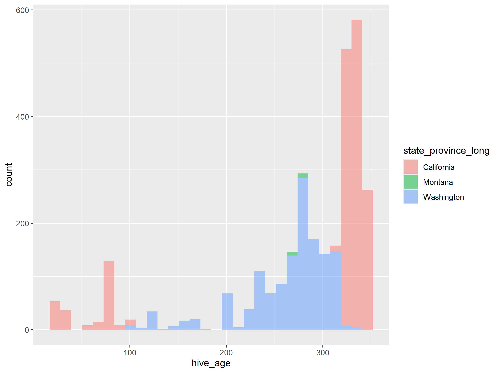
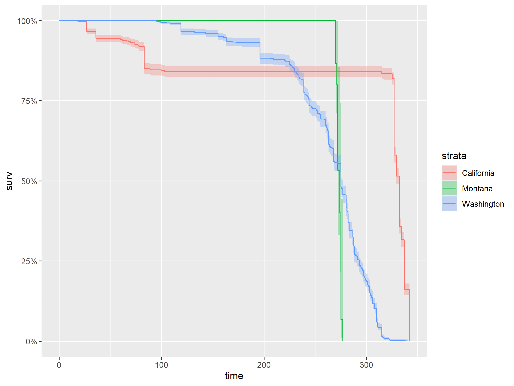
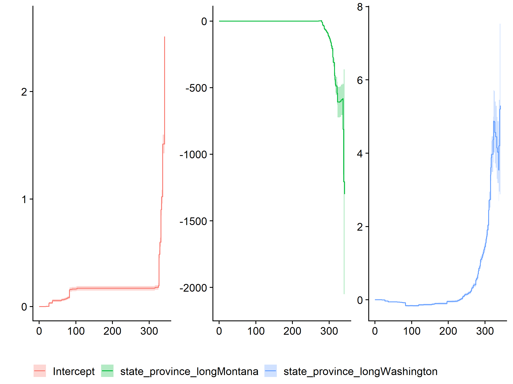

Taydin’s Survival Analysis
================
Dr. Riley M. Anderson & Taydin R. Macon
January 17, 2025

  

- [Overview](#overview)
  - [Summary of Results](#summary-of-results)
- [Session Information](#session-information)

## Overview

What is this analysis about?

### Summary of Results

- 

<!-- -->

      range(start_month)
    1                  1
    2                  1
    # A tibble: 5,316 × 3
    # Groups:   tag_serial_number [2,696]
       tag_serial_number state_province_long     n
       <fct>             <fct>               <int>
     1 539708            California             13
     2 539708            Washington             12
     3 539709            California             13
     4 539709            Washington             10
     5 539710            California             11
     6 539710            Washington             10
     7 539711            California             11
     8 539711            Washington              8
     9 539712            California             10
    10 539712            Washington              6
    # ℹ 5,306 more rows

<!-- -->

    ## Call: survfit(formula = Surv(hive_age) ~ state_province_long, data = surv_time)
    ## 
    ##                 state_province_long=California 
    ##  time n.risk n.event survival std.err lower 95% CI upper 95% CI
    ##     1   1631       0    1.000 0.00000        1.000        1.000
    ##    10   1631       0    1.000 0.00000        1.000        1.000
    ##    20   1628       3    0.998 0.00106        0.996        1.000
    ##    30   1578      50    0.968 0.00439        0.959        0.976
    ##    60   1542      42    0.942 0.00580        0.930        0.953
    ##    90   1382     155    0.847 0.00892        0.829        0.864
    ##   120   1371      10    0.841 0.00906        0.823        0.859
    ##   150   1371       0    0.841 0.00906        0.823        0.859
    ##   180   1371       0    0.841 0.00906        0.823        0.859
    ##   210   1371       0    0.841 0.00906        0.823        0.859
    ##   240   1371       0    0.841 0.00906        0.823        0.859
    ##   270   1371       0    0.841 0.00906        0.823        0.859
    ##   300   1371       0    0.841 0.00906        0.823        0.859
    ##   330    841     530    0.516 0.01237        0.492        0.540
    ## 
    ##                 state_province_long=Montana 
    ##  time n.risk n.event survival std.err lower 95% CI upper 95% CI
    ##     1     15       0    1.000  0.0000        1.000            1
    ##    10     15       0    1.000  0.0000        1.000            1
    ##    20     15       0    1.000  0.0000        1.000            1
    ##    30     15       0    1.000  0.0000        1.000            1
    ##    60     15       0    1.000  0.0000        1.000            1
    ##    90     15       0    1.000  0.0000        1.000            1
    ##   120     15       0    1.000  0.0000        1.000            1
    ##   150     15       0    1.000  0.0000        1.000            1
    ##   180     15       0    1.000  0.0000        1.000            1
    ##   210     15       0    1.000  0.0000        1.000            1
    ##   240     15       0    1.000  0.0000        1.000            1
    ##   270     15       2    0.867  0.0878        0.711            1
    ## 
    ##                 state_province_long=Washington 
    ##  time n.risk n.event survival std.err lower 95% CI upper 95% CI
    ##     1   1362       0   1.0000 0.00000     1.000000      1.00000
    ##    10   1362       0   1.0000 0.00000     1.000000      1.00000
    ##    20   1362       0   1.0000 0.00000     1.000000      1.00000
    ##    30   1362       0   1.0000 0.00000     1.000000      1.00000
    ##    60   1362       0   1.0000 0.00000     1.000000      1.00000
    ##    90   1362       0   1.0000 0.00000     1.000000      1.00000
    ##   120   1316      46   0.9662 0.00489     0.956680      0.97587
    ##   150   1308       8   0.9604 0.00529     0.950045      0.97077
    ##   180   1270      38   0.9325 0.00680     0.919219      0.94588
    ##   210   1199      71   0.8803 0.00880     0.863253      0.89773
    ##   240   1056     150   0.7702 0.01140     0.748169      0.79286
    ##   270    760     289   0.5580 0.01346     0.532242      0.58501
    ##   300    260     505   0.1872 0.01057     0.167613      0.20913
    ##   330      3     252   0.0022 0.00127     0.000711      0.00682

<!-- -->

    ## Call:
    ## coxph(formula = Surv(hive_age) ~ state_province_long, data = surv_time)
    ## 
    ##   n= 3008, number of events= 3008 
    ## 
    ##                                   coef exp(coef) se(coef)     z Pr(>|z|)    
    ## state_province_longMontana     2.78850  16.25668  0.26621 10.47   <2e-16 ***
    ## state_province_longWashington  2.47130  11.83785  0.06176 40.01   <2e-16 ***
    ## ---
    ## Signif. codes:  0 '***' 0.001 '**' 0.01 '*' 0.05 '.' 0.1 ' ' 1
    ## 
    ##                               exp(coef) exp(-coef) lower .95 upper .95
    ## state_province_longMontana        16.26    0.06151     9.648     27.39
    ## state_province_longWashington     11.84    0.08447    10.488     13.36
    ## 
    ## Concordance= 0.677  (se = 0.005 )
    ## Likelihood ratio test= 1939  on 2 df,   p=<2e-16
    ## Wald test            = 1606  on 2 df,   p=<2e-16
    ## Score (logrank) test = 2017  on 2 df,   p=<2e-16

<!-- -->

<!-- -->

## Session Information

    R version 4.2.3 (2023-03-15 ucrt)
    Platform: x86_64-w64-mingw32/x64 (64-bit)
    Running under: Windows 10 x64 (build 19045)

    Matrix products: default

    locale:
    [1] LC_COLLATE=English_United States.utf8 
    [2] LC_CTYPE=English_United States.utf8   
    [3] LC_MONETARY=English_United States.utf8
    [4] LC_NUMERIC=C                          
    [5] LC_TIME=English_United States.utf8    

    attached base packages:
    [1] stats     graphics  grDevices utils     datasets  methods   base     

    other attached packages:
     [1] ggfortify_0.4.17 ranger_0.16.0    survival_3.5-3   cowplot_1.1.3   
     [5] lubridate_1.9.3  forcats_1.0.0    stringr_1.5.1    dplyr_1.1.4     
     [9] purrr_1.0.2      readr_2.1.5      tidyr_1.3.1      tibble_3.2.1    
    [13] ggplot2_3.5.1    tidyverse_2.0.0 

    loaded via a namespace (and not attached):
     [1] Rcpp_1.0.12       highr_0.11        pillar_1.9.0      compiler_4.2.3   
     [5] tools_4.2.3       digest_0.6.35     lattice_0.20-45   timechange_0.3.0 
     [9] evaluate_0.24.0   lifecycle_1.0.4   gtable_0.3.5      pkgconfig_2.0.3  
    [13] rlang_1.1.4       Matrix_1.5-3      cli_3.6.2         rstudioapi_0.16.0
    [17] yaml_2.3.8        xfun_0.44         fastmap_1.2.0     gridExtra_2.3    
    [21] withr_3.0.0       knitr_1.47        generics_0.1.3    vctrs_0.6.5      
    [25] hms_1.1.3         rprojroot_2.0.4   grid_4.2.3        tidyselect_1.2.1 
    [29] glue_1.7.0        R6_2.5.1          fansi_1.0.6       rmarkdown_2.27   
    [33] farver_2.1.2      tzdb_0.4.0        magrittr_2.0.3    codetools_0.2-19 
    [37] splines_4.2.3     scales_1.3.0      htmltools_0.5.8.1 colorspace_2.1-0 
    [41] labeling_0.4.3    utf8_1.2.4        stringi_1.8.4     munsell_0.5.1    
